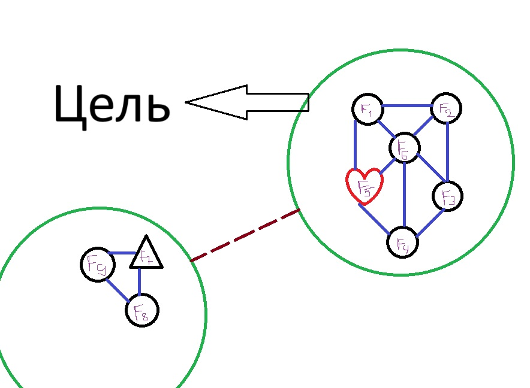
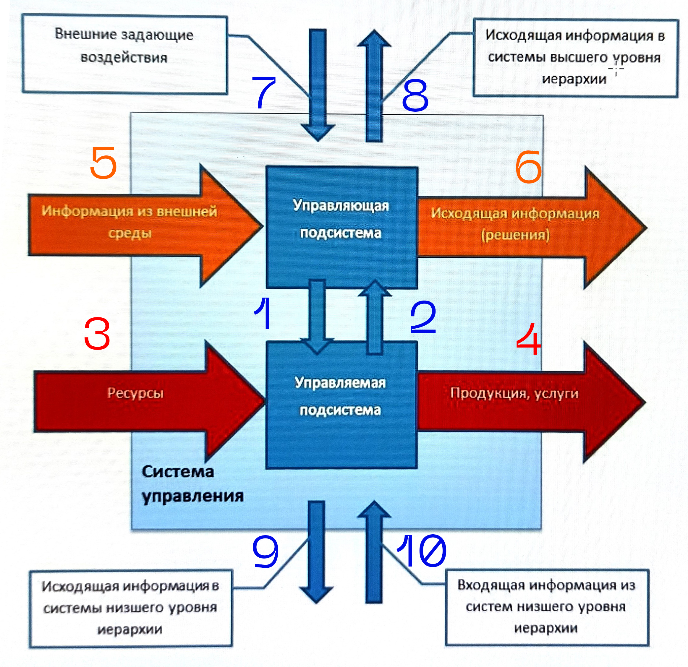

**Элемент** - часть системы функционирующая в рамка определенной системы.
**Система**	- это сововкупность элементов, взаимодействующих между собой и внешней средой, представляющих единое целое по отношению к окружающей среде и выполняющих определнные функции для достижения целей.
Какой самый главный элемент организации? Люди конечно же!!!!!1!!

Когда  мы знаем определение системы, можем дать опредление управлению.

**Цель** - желаемый результат, цель - то чего мы хотим. 
Желание хочу и понимаю что неисполнимые.

1.   управляющее воздействие
2.   информация по обратному каналу связи
3.   ресурсы на входе управляемой подсистемы
4.   готовая продукция/услуги
5.   информация из внешней среды
6.   информация во внешнюю среду
7.   входящая информация из систем высшего уровня
8.   исходящая информация в системы высшего уровня
9.   исходящая информация в системы нисшего уровня
10.  входящая информация из систем нисшего уровня

> в организации управляемая подсистема - производственная подсистема

**Управление** - управление это целенаправленное воздействие субъекта на объект. Управление это всегда иерархический процесс.

Любая организация представляет собой систему и относится к классу социально-экономических систем, аследоваельно имеет социальные и экономические цели. Главная социальная цель - **удовлетворение потребностей общества**. Главная экономическая цель - **получение или максимизация прибыли**.

Системный анализ в менеджменте

**Менеджмент** - управление социально-экономическими системами или управление организации. Это самые простейшие определения мы даем, самые короткие.

