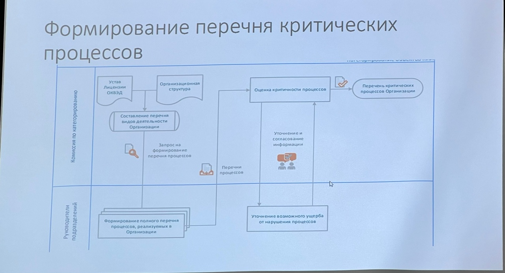

# Категорирование бъектов критической информационной инфраструктуры
### 187-ФЗ "О безопасности критической инфорационной инфраструктуры Российской Федерации"

В соответствии с требованиями Закона, **субъекты КИИ** должны **присвоить одну из категорий значимости** принадлежащим им объектам КИИ.

Если объект КИИ не соответствует критериям значимости, показателям этих критериев и их значениям, ему но присваивается ни одна из таких категорий.

Критерии значимости, показатели их значений, а также порядок осуществления категорирования определены в **Постановлении Правительства РФ от 8 февраля 2018 г. Nº 127 «Об утверждении Правил категорирования объектов критической информационной инфраструктуры Российской Федерации, а также перечня показателей критериев значимости объектов критической информационной инфраструктуры Российской Федерации и их значений»**

В соответствии с требованиями 187-ФЗ, субъект КИИ должен направить **сведения** о результатах категорирования своих объектов КИИ **во ФСТЭК России** (Федеральный орган исполнительной власти, уполномоченный в области обеспечения безопасности КИИ РФ).

**Форма направления сведений определена приказом ФСТЭК России от 22 декабря 2017 г. Nº 236** «Об утверждении формы направления сведений о результатах присвоения объекту критической информационной инфраструктуры одной из категорий значимости либо об отсутствии необходимости присвоения ему одной из таких категорий».

### Общий порядок работ
1. Определение принадлежности к субъектам КИИ;
2. Создание комиссии по категорированию;
3. Формирование перечня критических процессов субъекта КИИ;
4. Формирование перечня объектов КИИ, подлежащих категорированию;
5. Категорирование объектов критической информационной инфраструктуры

## Субъект КИИ

В соответствии с определением в 187-93, субьет КИИ - это:
1) государственный орган, государственное учреждение, российское юридическое лицо и (или) индивидуальный предприниматель, которому по праву собственности, аренды или на ином законном основании принадлежат информационные системы, информационно-телекоммуникационные сети, автоматизированные системы управления, функционирующие в сфере:
    - здравоохранения;
    - науки;
    - транспорта;
    - связи;
    - энергетики;
    - банковской сфере и иных сферах финансового рынка;
    - топливно-энергетического комплекса;
    - атомной энергии;
    - оборонной промышленности; 
    - ракетно-космической промышленности;
    - горнодобывающей промышленности;
    - металлургической промышленности;
    - химической промышленности;

-   Для субъектов, относящихся **к сфере здравоохранения рекомендуется использовать документ** «Методические рекомендации по категорированию объектов критической информационной инфраструктуры сферы здравоохранения»
-   Для субъектов, являющихся **операторами связи** рекомендуется использовать документ «Методические рекомендации по категорированию объектов критической информационной инфраструктуры, принадлежащих субъектам критической информационной инфраструктуры, функционирующим в сфере связи».
-   Для субъектов, работающих **в сфере Топливно-Энергетический Комплекс** рекомендуется использовать документ «Методические рекомендации по определению и категорированию объектов критической информационной инфраструктуры топливно-энергетического комплекса».

В соответствии с разъяснениями ФСТЭК России, достаточным фактом для признания организации субъектом является сочетание следующих факторов:
- организация работает в одной из указанных сфер;
- организация владеет какими-либо ИС, АСУ, ИТС.

То есть предлагается отталкиваться от сферы работы организации, а не от области функционирования систем. Этот подход упраздняет все шаги, приводимые далее в этом подразделе и в случае выполнения данного условия организация признается субъектом КИИ.

**Пример 1** Проектно-конструкторская организация, работающая в сфере науки, в соответствии с 127-Ф3 «О науке и государственной научно-технической политике», и обладающая собственной ИС для автоматизации, учета проектов и работы сотрудников (относится к сфере науки).

>Рассматриваемая организация **является субъектом КИИ**

**Пример 2** Организация является **владельцем электростанции** и соответствующего оборудования. **Также существует Региональное диспетчерское управление СО ЕЭС**, которое владеет собственным оборудованием мониторинга и управления, **взаимодействующим с оборудованием станции**.

>В данном случае **обе организации являются субъектами КИИ**, обладающими своими объектами КИИ.

### Исключения

1) Организация **не занимаетя рассматриваемой деятельностью**, в соответствих с приведенными класси фикаторами и документами, **но ей принадлежат системы, Функционирующие в указанной сфере**.

    **Пример 1** Организация **Nº1 не работает непосредственно** в рассиатриваемых областах, **но владеет специализированной ИС и предоставляет ее по подтиске в виде облачного сервиса** - Организация Nº1 **не будет признана** субъектом КИИ.

    Но, часто получается, что подобный сервис предоставляется некой другой организации - Организация 2, которая **непосредственно работает в одной из рассматриваемых сфер и использует его в целях реализации своей деятельности**

    В данном варианте **Организация Nº2 будет являться субъехтом КИИ**, а **поставщих облачного сервиса (Организация Nº1) должен будет выполнять требования безопасности, определяемые потребителем услуг по результатам категорирования**

2) Организация **работает в рассматриваемых областях**, но **не имеет специализированных систем, работающих в указанных сферах**. Такие организации **рассматривается как субъекты КИИ, не имеющие значимых объектов КИИ**.

**Пример** Организация, осуществляющая подготовку научных работников — центр дополнительного профессионального образования (относится к сфере науки в соответствии с 127-Ф3 «О науке и государственной научно-технической политике»).

>В организации может не быть систем, функционирующих в сфере науки.

## Субъекты, обеспечивающие взаимодействие объектов КИИ

В качестве обеспечения взаимодействия объектов КИИ может рассматриваться:
- предоставление и организация каналов информационного обмена (выделенные каналы доступа, а также локальные сети связи, например, в ЦОД);
- предоставление телекоммуникационных услуг, в рамках которых осуществляется взаимодействие объектов КИИ;
- предоставление иных информационных услуг для обеспечения взаимодействия с объектами КИИ.

Частными случаями таких субъектов являются **операторы систем и сетей связи**, обеспечивающие взаимодействие конкретных объектов, являющихся объектами КИИ.

Для данных лиц ответственность за обеспечение взаимодействия объектов КИИ указывается в документации на системы/каналы связи, а также в их обязанностях

**Пример 1** Организация владеет и обслуживает ЦОД, в котором размещаются ИС третьих сторон.

В рамках инвентаризации/запроса информации **выявлено, что некоторые из размещаемых в ЦОД систем относятся к объектам КИИ**.

Программноаппаратное обеспечение компонентов ИС является собственностью третьих сторон. При этом, **для взаимодействия между данными объектами КИИ, а также с внешними системами и пользователями используются каналы передачи данных и коммутационное оборудование ЦОД**, которые принадлежат Организации. **В данном случае Организация является субъектом КИИ**, как обеспечивающая взаимодействие объектов КИИ.

**Часть инфраструктуры Организации**, непосредственно задействованная в **обеспечении взаимодействия объектов КИИ, должна рассматриваться в качестве объекта КИИ**.

**Пример 2** Организация предоставляет услуги **технической поддержки и сопровождения группе компаний**, занимающихся нефтедобычей.

Работники Организации администрируют ИС, ИТС и АСУ компаний, являющихся объектами КИИ, управляют сетевыми компонентами, отвечают за работоспособность и взаимодействие систем.

В данном случае **Организация не является субъектом КИИ**, так как ее работники обеспечивают «поддержку» работоспособности систем, **но фактически взаимодействие объектов КИИ обеспечивается программноаппаратными компонентами, находящимися в собственности самих компаний, а не Организации**

## Создание комиссии по категорированию. Состав комиссии

Для проведения мероприятий по категорированию в соответствии с п. 11 127 ПП **решением руководителя субъекта КИИ** создается **постоянно действующая** комиссия по категорированию.

Состав комиссии по категорированию (в соответствии с 127ПП):
1)  Руководитель субъекта критической информационной инфраструктуры или уполномоченное им лицо;
2)  Работники субъекта критической информационной инфраструктуры:
    - Руководители критичных направлений деятельности, процессы которых автоматизируются ИС / АСУ;
    - Руководители ИТ-подразделения;
    - Руководитель отдела автоматизации (АСУ ТП) — в случае наличия;
    - Ответственный за промышленную безопасность на предприятии — в случае наличия; 
    - Ответственный за контроль за опасными веществами и материалами — в случае наличия
3)  Работники на которых возложены функции обеспечения безопасности (информационной безопасности):
    
    -   Руководитель ИБ-подразделения (администратор ИБ в случае отсутствия выделенного подразделения).

>B соответсвии с требованиями 235 Приказа ФСТЭК функциональная единица,
отвечающая за ИБ, должна быть **выделенной**, то есть **администраторы ИТ или Отдел АСУ ТП** не может отвечать за обеспечение ИБ.
4)  Руководитель подразделения по защите государственной тайны - в случае наличия;
5)  Руководитель Отдела по ГОиЧС — в случае наличия;
6)  Иные работники по решению Руководителя субъекта КИИ

### В состав организации входит филиальная сеть

1. Филиалы являются самостоятельными юридическими лицами

    Оптимальным решением будет **включение в состав** всех частных комиссий, создаваемых в каждом субъекте КИИ, ответственного (ответственных) со стороны головной организации **или согласование** принимаемых решений комиссией головной организации в иной форме

2. Филиалы являются подразделениями организации в рамках единого юридического лица.

    В соответствии с п. 11.2 127ПП, по решению руководителя субъекта КИИ, имеющего филиалы, представительства, **могут создаваться отдельные комиссии по категорированию объектов КИИ в этих филиалах**, представительствах. При этом **общую координацию** и контроль деятельности комиссий по категорированию **в филиалах должна осуществлять комиссия по категорированию субъекта КИИ (юридического лица в целом)**.

>Формирование перечня критических процессов