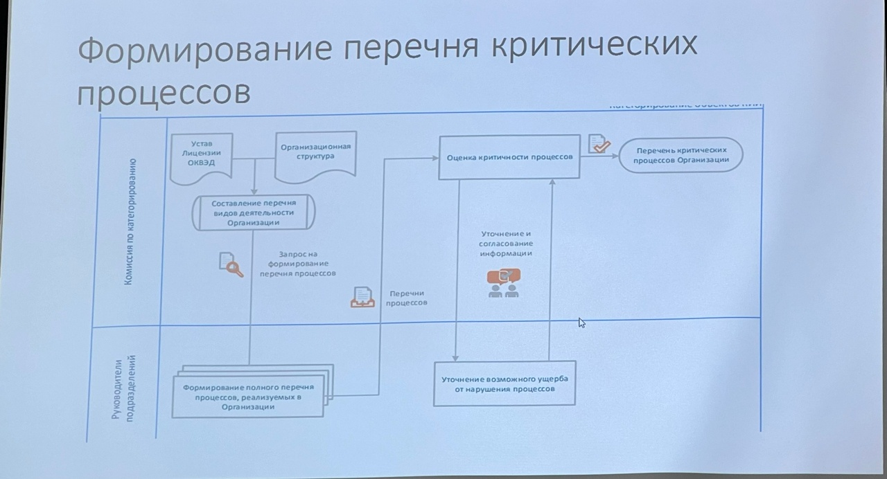

# Категорирование бъектов критической информационной инфраструктуры
### 187-ФЗ "О безопасности критической инфорационной инфраструктуры Российской Федерации"

В соответствии с требованиями Закона, **субъекты КИИ** должны **присвоить одну из категорий значимости** принадлежащим им объектам КИИ.

Если объект КИИ не соответствует критериям значимости, показателям этих критериев и их значениям, ему но присваивается ни одна из таких категорий.

Критерии значимости, показатели их значений, а также порядок осуществления категорирования определены в **Постановлении Правительства РФ от 8 февраля 2018 г. Nº 127 «Об утверждении Правил категорирования объектов критической информационной инфраструктуры Российской Федерации, а также перечня показателей критериев значимости объектов критической информационной инфраструктуры Российской Федерации и их значений»**

В соответствии с требованиями 187-ФЗ, субъект КИИ должен направить **сведения** о результатах категорирования своих объектов КИИ **во ФСТЭК России** (Федеральный орган исполнительной власти, уполномоченный в области обеспечения безопасности КИИ РФ).

**Форма направления сведений определена приказом ФСТЭК России от 22 декабря 2017 г. Nº 236** «Об утверждении формы направления сведений о результатах присвоения объекту критической информационной инфраструктуры одной из категорий значимости либо об отсутствии необходимости присвоения ему одной из таких категорий».

### Общий порядок работ
1. Определение принадлежности к субъектам КИИ;
2. Создание комиссии по категорированию;
3. Формирование перечня критических процессов субъекта КИИ;
4. Формирование перечня объектов КИИ, подлежащих категорированию;
5. Категорирование объектов критической информационной инфраструктуры

## Субъект КИИ

В соответствии с определением в 187-93, субьет КИИ - это:
1) государственный орган, государственное учреждение, российское юридическое лицо и (или) индивидуальный предприниматель, которому по праву собственности, аренды или на ином законном основании принадлежат информационные системы, информационно-телекоммуникационные сети, автоматизированные системы управления, функционирующие в сфере:
    - здравоохранения;
    - науки;
    - транспорта;
    - связи;
    - энергетики;
    - банковской сфере и иных сферах финансового рынка;
    - топливно-энергетического комплекса;
    - атомной энергии;
    - оборонной промышленности; 
    - ракетно-космической промышленности;
    - горнодобывающей промышленности;
    - металлургической промышленности;
    - химической промышленности;

-   Для субъектов, относящихся **к сфере здравоохранения рекомендуется использовать документ** «Методические рекомендации по категорированию объектов критической информационной инфраструктуры сферы здравоохранения»
-   Для субъектов, являющихся **операторами связи** рекомендуется использовать документ «Методические рекомендации по категорированию объектов критической информационной инфраструктуры, принадлежащих субъектам критической информационной инфраструктуры, функционирующим в сфере связи».
-   Для субъектов, работающих **в сфере Топливно-Энергетический Комплекс** рекомендуется использовать документ «Методические рекомендации по определению и категорированию объектов критической информационной инфраструктуры топливно-энергетического комплекса».

В соответствии с разъяснениями ФСТЭК России, достаточным фактом для признания организации субъектом является сочетание следующих факторов:
- организация работает в одной из указанных сфер;
- организация владеет какими-либо ИС, АСУ, ИТС.

То есть предлагается отталкиваться от сферы работы организации, а не от области функционирования систем. Этот подход упраздняет все шаги, приводимые далее в этом подразделе и в случае выполнения данного условия организация признается субъектом КИИ.

**Пример 1** Проектно-конструкторская организация, работающая в сфере науки, в соответствии с 127-Ф3 «О науке и государственной научно-технической политике», и обладающая собственной ИС для автоматизации, учета проектов и работы сотрудников (относится к сфере науки).

>Рассматриваемая организация **является субъектом КИИ**

**Пример 2** Организация является **владельцем электростанции** и соответствующего оборудования. **Также существует Региональное диспетчерское управление СО ЕЭС**, которое владеет собственным оборудованием мониторинга и управления, **взаимодействующим с оборудованием станции**.

>В данном случае **обе организации являются субъектами КИИ**, обладающими своими объектами КИИ.

### Исключения

1) Организация **не занимаетя рассматриваемой деятельностью**, в соответствих с приведенными класси фикаторами и документами, **но ей принадлежат системы, Функционирующие в указанной сфере**.

    **Пример 1** Организация **Nº1 не работает непосредственно** в рассиатриваемых областах, **но владеет специализированной ИС и предоставляет ее по подтиске в виде облачного сервиса** - Организация Nº1 **не будет признана** субъектом КИИ.

    Но, часто получается, что подобный сервис предоставляется некой другой организации - Организация 2, которая **непосредственно работает в одной из рассматриваемых сфер и использует его в целях реализации своей деятельности**

    В данном варианте **Организация Nº2 будет являться субъехтом КИИ**, а **поставщих облачного сервиса (Организация Nº1) должен будет выполнять требования безопасности, определяемые потребителем услуг по результатам категорирования**

2) Организация **работает в рассматриваемых областях**, но **не имеет специализированных систем, работающих в указанных сферах**. Такие организации **рассматривается как субъекты КИИ, не имеющие значимых объектов КИИ**.

**Пример** Организация, осуществляющая подготовку научных работников — центр дополнительного профессионального образования (относится к сфере науки в соответствии с 127-Ф3 «О науке и государственной научно-технической политике»).

>В организации может не быть систем, функционирующих в сфере науки.

## Субъекты, обеспечивающие взаимодействие объектов КИИ

В качестве обеспечения взаимодействия объектов КИИ может рассматриваться:
- предоставление и организация каналов информационного обмена (выделенные каналы доступа, а также локальные сети связи, например, в ЦОД);
- предоставление телекоммуникационных услуг, в рамках которых осуществляется взаимодействие объектов КИИ;
- предоставление иных информационных услуг для обеспечения взаимодействия с объектами КИИ.

Частными случаями таких субъектов являются **операторы систем и сетей связи**, обеспечивающие взаимодействие конкретных объектов, являющихся объектами КИИ.

Для данных лиц ответственность за обеспечение взаимодействия объектов КИИ указывается в документации на системы/каналы связи, а также в их обязанностях

**Пример 1** Организация владеет и обслуживает ЦОД, в котором размещаются ИС третьих сторон.

В рамках инвентаризации/запроса информации **выявлено, что некоторые из размещаемых в ЦОД систем относятся к объектам КИИ**.

Программноаппаратное обеспечение компонентов ИС является собственностью третьих сторон. При этом, **для взаимодействия между данными объектами КИИ, а также с внешними системами и пользователями используются каналы передачи данных и коммутационное оборудование ЦОД**, которые принадлежат Организации. **В данном случае Организация является субъектом КИИ**, как обеспечивающая взаимодействие объектов КИИ.

**Часть инфраструктуры Организации**, непосредственно задействованная в **обеспечении взаимодействия объектов КИИ, должна рассматриваться в качестве объекта КИИ**.

**Пример 2** Организация предоставляет услуги **технической поддержки и сопровождения группе компаний**, занимающихся нефтедобычей.

Работники Организации администрируют ИС, ИТС и АСУ компаний, являющихся объектами КИИ, управляют сетевыми компонентами, отвечают за работоспособность и взаимодействие систем.

В данном случае **Организация не является субъектом КИИ**, так как ее работники обеспечивают «поддержку» работоспособности систем, **но фактически взаимодействие объектов КИИ обеспечивается программноаппаратными компонентами, находящимися в собственности самих компаний, а не Организации**

## Создание комиссии по категорированию. Состав комиссии

Для проведения мероприятий по категорированию в соответствии с п. 11 127 ПП **решением руководителя субъекта КИИ** создается **постоянно действующая** комиссия по категорированию.

Состав комиссии по категорированию (в соответствии с 127ПП):
1)  Руководитель субъекта критической информационной инфраструктуры или уполномоченное им лицо;
2)  Работники субъекта критической информационной инфраструктуры:
    - Руководители критичных направлений деятельности, процессы которых автоматизируются ИС / АСУ;
    - Руководители ИТ-подразделения;
    - Руководитель отдела автоматизации (АСУ ТП) — в случае наличия;
    - Ответственный за промышленную безопасность на предприятии — в случае наличия; 
    - Ответственный за контроль за опасными веществами и материалами — в случае наличия
3)  Работники на которых возложены функции обеспечения безопасности (информационной безопасности):
    
    -   Руководитель ИБ-подразделения (администратор ИБ в случае отсутствия выделенного подразделения).

>B соответсвии с требованиями 235 Приказа ФСТЭК функциональная единица,
отвечающая за ИБ, должна быть **выделенной**, то есть **администраторы ИТ или Отдел АСУ ТП** не может отвечать за обеспечение ИБ.
4)  Руководитель подразделения по защите государственной тайны - в случае наличия;
5)  Руководитель Отдела по ГОиЧС — в случае наличия;
6)  Иные работники по решению Руководителя субъекта КИИ

### В состав организации входит филиальная сеть

1. Филиалы являются самостоятельными юридическими лицами

    Оптимальным решением будет **включение в состав** всех частных комиссий, создаваемых в каждом субъекте КИИ, ответственного (ответственных) со стороны головной организации **или согласование** принимаемых решений комиссией головной организации в иной форме

2. Филиалы являются подразделениями организации в рамках единого юридического лица.

    В соответствии с п. 11.2 127ПП, по решению руководителя субъекта КИИ, имеющего филиалы, представительства, **могут создаваться отдельные комиссии по категорированию объектов КИИ в этих филиалах**, представительствах. При этом **общую координацию** и контроль деятельности комиссий по категорированию **в филиалах должна осуществлять комиссия по категорированию субъекта КИИ (юридического лица в целом)**.

>Формирование перечня критических процессов

## Детализация процессов

Степень обобщенности или декомпозиции процессов **не регламентирована и остается на усмотрение Организации**.

Рекомендуется делать детальное подразделение процессов, относящихся к основным видам деятельности Организации. Как некоторую отправную точку можно взять организационную структуру Организации и отталкиваться от принципа «одно подразделение нижнего уровня - один процесс», а дальше уже корректировать по необходимости.
* В перечень включаются процессы, реализующие виды деятельности, соответствующие областям (сферам), установленным пунктом 8 статьи 2 Федерального закона «О безопасности критической информационной инфраструктуры Российской Федерации».

## Процесс бухгалтерского делопроизводства или иной финансовой деятельности
В общем случае бухгалтерские расчеты, выплата налогов и т.д. не является одним из указанных видов деятельности, поэтому **не должны включаться в перечень**.

Можно специально выделить процесс «Закупка сырья», связанный с процессом производственной деятельности, но это скорее **искусственное усложнение**, так как конечная цель - выделение объектов, **а любые закупки или переводы не завязаны строго на системах 1С и к ним не предьявляются жесткие требования безотказного функционирования** - оплату можно сделать с помощью печатной формы через банк.

Входят ли в процесс производства такие связанные процессы, как противоаварийная защита, процесс контроля доступа, процесс пожаротушения, извещение о чрезвычайных ситуациях и т. д.?
-   Видеонаблюдение, контроль доступа, сигнализация и т. д. могут быть связаны и взаимодействовать с производственными процессами, но, как правило, само **производство технически может функционировать без них**.
-   Сам факт нарушения контроля доступа или видеофиксации не влечет автоматически какого-то ущерба. Поэтому данные процессы должны выделяться отдельно и в большинстве случаев **они не будут являться критическими**.
-   **Противоаварийная** автоматика **может рассматриваться** как часть производственного процесса, **если она технически интегрирована** в промышленные системы, **а может** рассматриваться в качестве самостоятельного объекта и процесса.

## Определение критичности процессов
Для каждого выявленного процесса должна быть проведена оценка критичности его нарушения с точки зрения возможных негативных социальных, политических, экономических, экологических последствий, последствий для обеспечения обороны страны, безопасности государства и правопорядка.

В соответствии с разъяснениями ФСТЭК России, критическим процесс становится, если есть соответствующие последствия от нарушений в любом масштабе, даже если они по своему масштабу не превышают нижний порог показателей для 3-й категории значимости, поэтому оцениваются не масштабы возможных последствий, а сам факт их возможности.

Рекомендуется (требования в нормативной документации отсутствуют) при оценке критичности процессов результаты анализа отражать в Отчете об обследовании объектов критической информационной инфраструктуры

В случае, если для рассматриваемого процесса актуален какой-либо из показателей, то процесс считается критическим.

## Показатели

<table>
        <thead>
            <tr>
                <th>№</th>
                <th>Показатель</th>
                <th>Критерий оценки актуальности показателей</th>
            </tr>
        </thead>
        <tbody>
            <tr>
                <td colspan="3">I. Социальная значимость</td>
            </tr>
            <tr>
                <td>1</td>
                <td>Причинение ущерба жизни и здоровью людей (человек)</td>
                <td>Возможность причинения ущерба жизни и здоровью из-за нарушения рассматриваемого процесса (остановка процесса или сбой в нем / изменение параметров, в том числе выход за предел допустимых). 
                

Рассматриваются: 
                
1. Непосредственные последствия от нарушения технологических процессов, связанные с угрозой для работников и людей, находящихся в близости от оборудования (выработка электроэнергии, химическое производство, управление металлургическим производством и т.д.); 
                
2. Последствия, связанные с нарушением процесса как оказываемой услуги, и представляющие угрозу для потребителей услуги (управление движением железно-дорожных составов, оказание срочной медицинской помощи, фармацевтическая деятельность, производство транспортных средств и т.д.).
</td>
            </tr>
            <tr>
                <td>2</td>
                <td>Прекращение или нарушение функционирования объектов обеспечения жизнедеятельности населения</td>
                <td>Актуален для процессов, участвующих в обеспечении жизнедеятельности населения (водо-, тепло-, газо- и электроснабжение), нарушение которых может привести к прекращению оказания данных услуг (прекращение подачи воды, тепла, газа, электричества) или к отклонению значений параметров указанных услуг от проектных (штатных) режимов функционирования (падение напряжения электросети, снижение температуры или напора горячей воды/теплоносителя и т.д.). В рассматриваемых масштабах нарушение объектов обеспечения жизнедеятельности самого субъекта КИИ не попадает в критичные значения, то есть аварии на котельной предприятия, на локальных распределительных щитах, канализации и т.д. не являются достаточным фактором, если они не повлекли последствия в более обширном масштабе, в рамках оказания соответствующих услуг населению</td>
            </tr>
            <tr>
                <td>3</td>
                <td>Прекращение или нарушение функционирования объектов транспортной инфраструктуры</td>
                <td>Актуален для процессов, связанных с управлением объектами транспортной инфраструктуры, нарушение которых может привести к прекращению функционирования данных объектов (нарушение работы транспорта) или к отклонению значений параметров функционирования данных объектов от проектных (штатных) режимов функционирования (сбои в движении электропоездов, задержки в регистрации пассажиров, багажа, сбои в работе трубопровода, связанные с изменением давления и т.д.)</td>
            </tr>
            <tr>
                <td>4</td>
                <td>Прекращение или нарушение функционирования сети связи</td>
                <td>Актуален для процессов, связанных с управлением сетью связи, нарушение которых может привести к прекращению функционирования сети связи или к отклонению значений параметров функционирования сетей связи от проектных (штатных) режимов функционирования (сбои в передачи данных, падение скорости передачи данных, потеря пакетов и т.д.). Данный критерий актуален для организаций, предоставляющих услуги связи. Должны рассматриваться процессы управления каналообразующим оборудованием, обеспечения доступности услуг связи и т.д. Нарушение ЛВС самого субъекта КИИ не попадает в рассматриваемые критерии, то есть отказ ЛВС субъекта не являются достаточным фактором, если они не повлекли последствия в рамках оказания услуг связи.</td>
            </tr>
            <tr>
                <td>5</td>
                <td>Отсутствие доступа к государственной услуге</td>
                <td>Актуален для процессов, связанных с предоставлением государственных услуг, нарушение которых может привести к прекращению доступа к предоставляемым государственным услугам (автоматизация государственных услуг с помощью ГИС и связанных систем). Данный показатель должен рассматриваться организациями, на которых возложены соответствующие обязанности по оказанию государственных услуг и операторы ГИС. Участники предоставления государственных услуг, чьи процессы должны анализироваться, определяются в частных регламентах предоставления государственных услуг.</td>
            </tr>
        </tbody>
        <tbody>
            <tr>
                <td colspan="3">II. Политическая значимость</td>
            </tr>
            <tr>
                <td>6</td>
                <td>Прекращение или нарушение функционирования государственного органа в части невыполнения возложенной на него функции (полномочия)</td>
                <td>Актуален для процессов, связанных с реализацией функций (полномочий), возложенных на органы власти, нарушение которых может привести к прекращению реализации указанных функций (полномочий) (невозможность оказания государственных услуг, регистрации или предоставления соответствующей информации и т.д.) или к отклонению значений параметров реализации указанных функций (полномочий) от проектных (штатных) режимов (нарушение сроков реализации полномочий, временный переход на бумажный документооборот, возможность реализации полномочий с привлечением дополнительных ресурсов и т.д.). Данный критерий актуален непосредственно для органов власти в части функций (полномочий), возложенных соответствующих нормативными актами</td>
            </tr>
            <tr>
                <td>7</td>
                <td>Нарушение условий международного договора Российской Федерации, срыв переговоров или подписания планируемого к заключению международного договора Российской Федерации</td>
                <td>Актуален для процессов, реализуемых во исполнение международных договоров; реализуемых в рамках преддоговорных условий; реализация которых способна оказать влияние на переговоры или подписание планируемого к заключению международного договора.</td>
            </tr>
        </tbody>
        <tbody>
            <tr>
                <td colspan="3">III. Экономическая значимость</td>
            </tr>
            <tr>
                <td>8</td>
                <td>Возникновение ущерба субъекту КИИ, который является государственной корпорацией, ГУП, государственной компанией, стратегическим акционерным обществом, стратегическим предприятием</td>
                <td>Актуален для процессов 
                
1. Являющихся источниками доходов указанных субъектов (остановка производства, транспортного процесса и т.д.); 
                
2. Нарушение которых способны повлечь причинение прямого финансового ущерба (техногенные катастрофы, пожары, взрывы, затопления и т.д.).
                
</td>
            </tr>
            <tr>
                <td>9</td>
                <td>Возникновение ущерба бюджетам Российской Федерации</td>
                <td>Актуален для процессов, связанных с производственной деятельностью, оказанием услуг или иной деятельностью, являющейся источником пополнения бюджета в виде налогов, акцизных и иных платежей. Должны рассматриваться любые процессы, нарушение которых приведет к уменьшению каких-либо выплат в бюджеты РФ: остановка производства, транспортного процесса и т.д. Нарушение процессов, связанных непосредственно с проведением выплат в бюджеты РФ (бухгалтерские процессы и процессы перевода денежных средств) не влечет прямого ущерба, так как выплаты в любом случае будут осуществлены (позже или с использованием бумажных носителей и иных форм отчетности), данные процессы не стоит относить к критическим по данному критерию</td>
            </tr>
            <tr>
                <td>10</td>
                <td>Прекращение или нарушение проведения клиентами операций по банковским счетам и (или) без открытия банковского счета или операций, осуществляемых субъектом критической информационной инфраструктуры, являющимся в соответствии с законодательством Российской Федерации системно значимой кредитной организацией, оператором услуг платежной инфраструктуры системно и (или) социально значимых платежных систем или системно значимой инфраструктурной организацией финансового рынка</td>
                <td>Актуален для процессов: 
                
1. связанных с реализацией проведения клиентами операций по банковским счетам и (или) без открытия банковского счета, нарушение которых может привести к прекращению указанных операций или к отклонению значений параметров указанных операций от проектных (штатных) (сбои в транзакциях, увеличение времени обработки транзакций и т.д.); 
    
2. связанных с реализацией операций, осуществляемых: системно значимой кредитной организацией; оператором услуг платежной инфраструктуры системно и (или) социально значимых платежных систем; системно значимой инфраструктурной организацией финансового рынка, нарушение которых может привести к прекращению указанных операций или к отклонению значений параметров указанных операций от проектных (штатных) (сбои в транзакциях, увеличение времени обработки транзакций и т.д.)
</td>
            </tr>
        </tbody>
        <tbody>
            <tr>
                <td colspan="3">IV. Экологическая значимость</td>
            </tr>
            <tr>
                <td>11</td>
                <td>Вредные воздействия на окружающую среду</td>
<td>Актуален для процессов, связанных с технологическими операциями и производством, нарушение которых может оказать непосредственное негативное воздействие на окружающую среду: 
                
-   ухудшение качества воды в поверхностных водоемах, обусловленное сбросами загрязняющих веществ
                
-   повышение уровня вредных загрязняющих веществ, в том числе радиоактивных веществ, в атмосфере, ухудшение состояния земель в результате выбросов или сбросов загрязняющих веществ или иные вредные воздействия. 
                
Примеры критических процессов: 
                
-   обогащение руды, 
-   производство серной кислоты, 
-   утилизации отходов термической обработкой,
-   транспортировка нефтепродуктов, 
-   контроль состояния и поставка фильтров для производства, 
-   налив, хранение и транспортировка нефтепродуктов. 
                
Примеры смежных процессов, которые могут не являться критичными: 
                
обеспечение физической безопасности и контроль доступа (СКУД), видеонаблюдение, электроснабжение (если его подача ведет к безопасному останову производства без соответствующих последствий). При оценке актуальности показателя для процесса необходимо рассматривать максимально негативный сценарий развития нарушения процесса, без учета компенсирующих мер (систем противоаварийной автоматики, систем защит и т.д.). То есть, стоит делать прогноз возможного развития аварии или сбоя без учета аварийных систем (за исключением вариантов, когда данные системы являются неотъемлемой технологической частью системы, на которую атака в целом не рассматривается). 
                
Пример: 
                
системы РАС и ПАЗ не рассматриваются как фактор, снижающий риск. Физические блокировки и ограничители можно принимать в расчет
</td>
            </tr>
        </tbody>
        <tbody>
            <tr>
                <td colspan="3">V. Значимость для обеспечения обороны страны, безопасности государства и правопорядка</td>
            </tr>
            <tr>
                <td>12</td>
                <td>Прекращение или нарушение (невыполнение установленных показателей) функционирования пункта управления (ситуационного центра)</td>
                <td>Актуален для процессов, связанных с обеспечением функционирования пунктов управления (ситуационных центров), нарушение которых может привести к прекращению функционирования пунктов управления (ситуационных центров) или к отклонению значений параметров функционирования от проектных (штатных) режимов (нарушение сроков реагирования, частичное нарушение импортируемой в ситуационный центр информации, ограничение числа пользователей ситуационного центра и т.д.).
</td>
            </tr>
            <tr>
                <td>13</td>
                <td>Снижение показателей государственного оборонного заказа, выполняемого (обеспечиваемого) субъектом</td>
                <td>Актуален для процессов, связанных с выполнением оборонного заказа, нарушение которых может привести к снижению объемов продукции или к увеличению времени выпуска продукции данного заказа (технологические, производственные процессы и процессы, поддерживающие их: поставка сырья, транспорт и т.д.). Данный показатель актуален для организаций, непосредственно выполняющих (обеспечивающих) государственный оборонный заказ10: головных исполнителей поставок продукции по государственному оборонному заказу, исполнителей, участвующих в поставках продукции по государственному оборонному заказу, участников кооперации головного исполнителя. Для организаций, которые не относятся к указанным лицам, но которые изготавливают какие-либо компоненты или предоставляют услуги, которыми в свою очередь пользуются указанные организации для выполнения государственного оборонного заказа, данный показатель не является актуальным
</td>
            </tr>
            <tr>
                <td>14</td>
                <td>Прекращение или нарушение функционирования (невыполнение установленных показателей) информационной системы в области обеспечения обороны страны, безопасности государства и правопорядка</td>
                <td>Актуален для процессов, связанных с обеспечением функционирования информационных систем в области обеспечения обороны страны, безопасности государства и правопорядка, нарушение которых может привести к прекращению функционирования указанных систем или к отклонению значений параметров функционирования данных систем от проектных (штатных) режимов. 
                
В общих случаях рассматриваются непосредственно процессы: 
                
1.  управления и сопровождения указанных систем; 
                
2.  предоставления доступа к указанным системам; 
                
3.  информационного обеспечения указанных систем
</td>
            </tr>
            <tr>
                <td>15</td>
                <td>Процесс обеспечивает функционирование объектов КИИ, принадлежащих другим субъектам</td>
                <td>Актуален для процессов обеспечения функционирования объектов КИИ, принадлежащих другим субъектам
</td>
            </tr>
        </tbody>
    </table>

Выявление критических процессов проводится экспертно, сформированной комиссией по категорированию на основании сведений о деятельности организации, запрашиваемых дополнительных сведений для конкретных показателей.
Результаты выявления критических процессов представляют в таблице

<table>
    <thead>
        <tr>
            <th scope="col">№</th>
            <th scope="col">Показатель</th>
            <th scope="col">Актуальность для процесса</th>
        </tr>
    </thead>
    <tbody>
        <tr>
            <td>1</td>
            <td>Причинение ущерба жизни и здоровью
людей (человек)</td>
        </tr>
    </tbody>
</table>

## Определение объектов кии
Перечень объектов КИИ, которые обрабатывают информацию, необходимую для обеспечения критических процессов, и (или) осуществляют управление, контроль или мониторинг критических процессов.

<table>
    <thead>
        <tr>
            <th scope="col" rowspan="2">№</th>
            <th scope="col" rowspan="2">Показатель</th>
            <th scope="col" colspan="10">Актуальность процессов</th>
        </tr>
        <tr>
            <th scope="col">П1</th>
            <th scope="col">П2</th>
            <th scope="col">П3</th>
            <th scope="col">П4</th>
            <th scope="col">П5</th>
            <th scope="col">П6</th>
            <th scope="col">П7</th>
            <th scope="col">П8</th>
            <th scope="col">П9</th>
            <th scope="col">П10</th>
        </tr>
    </thead>
    <tbody>
        <tr>
            <td>1</td>
            <td>Причинение ущерба жизни и здоровью
людей (человек)</td>
        </tr>
        <tr>
            <td>2</td>
            <td>Прекращение или нарушение
функционирования объектов обеспечения
жизнедеятельности населения
</td>
        </tr>
        <tr>
            <td>3</td>
            <td>Прекращение или нарушение
функционирования объектов транспортной
инфраструктуры</td>
        </tr>
        <tr>
            <td>4</td>
            <td>Прекращение или нарушение
функционирования сети связи</td>
        </tr>
        <tr>
            <td>5</td>
            <td>Отсутствие доступа к государственной
услуге</td>
        </tr>
        <tr>
            <td>6</td>
            <td>Прекращение или нарушение
функционирования государственного
органа в части невыполнения возложенной
на него функции (полномочия)</td>
        </tr>
        <tr>
            <td>7</td>
            <td>Нарушение условий международного
договора Российской Федерации, срыв
переговоров или подписания планируемого
к заключению международного договора
Российской Федерации</td>
        </tr>
        <tr>
            <td>8</td>
            <td>Возникновение ущерба субъекту КИИ,
который является государственной
корпорацией, ГУП, государственной
компанией, стратегическим акционерным
обществом, стратегическим предприятием</td>
        </tr>
        <tr>
            <td>9</td>
            <td>Возникновение ущерба бюджетам
Российской Федерации</td>
        </tr>
        <tr>
            <td>10</td>
            <td>Прекращение или нарушение проведения
клиентами операций по банковским счетам
и (или) без открытия банковского счета или операций, осуществляемых субъектом
критической информационной
инфраструктуры, являющимся в
соответствии с законодательством
Российской Федерации системно значимой
кредитной организацией, оператором услуг
платежной инфраструктуры системно и
(или) социально значимых платежных
систем или системно значимой
инфраструктурной организацией
финансового рынка </td>
        </tr>
        <tr>
            <td>11</td>
            <td>Вредные воздействия на окружающую
среду</td>
        </tr>
        <tr>
            <td>12</td>
            <td>Прекращение или нарушение
(невыполнение установленных
показателей) функционирования пункта
управления (ситуационного центра)</td>
        </tr>
        <tr>
            <td>13</td>
            <td>Снижение показателей государственного
оборонного заказа, выполняемого
(обеспечиваемого) субъектом критической
информационной инфраструктуры</td>
        </tr>
        <tr>
            <td>14</td>
            <td>Прекращение или нарушение
функционирования (невыполнение
установленных показателей)
информационной системы в области
обеспечения обороны страны,
безопасности государства и правопорядка</td>
        </tr>
         <tr>
            <td>15</td>
            <td>Процесс обеспечивает функционирование
объектов КИИ, принадлежащих другим
субъектам</td>
        </tr>
    </tbody>
</table>

### Информация об объектах КИИ
Заполняется для каждого объекта КИИ, подлежащего категорированию

#### 1. Общие сведения об объекте КИИ
<table>
    <tbody>
        <tr>
            <td>1.1</td>
            <td>Наименование объекта (наименование информационной системы, автоматизированной системы управления или информационно-телекоммуникационной сети)</td>
            <td> </td>
        </tr>
        <tr>
            <td>1.2</td>
            <td>Адреса размещения объекта, в том числе адреса обособленных подразделений (филиалов, представительств) субъекта критической информационной инфраструктуры, в которых размещаются сегменты распределенного объекта</td>
            <td> </td>
        </tr>
        <tr>
            <td>1.3</td>
            <td>Сфера (область) деятельности, в которой функционирует объект, в соответствии с пунктом 8 статьи 2 Федерального закона от 26 июля 2017 г. N 187-ФЗ "О безопасности критической информационной инфраструктуры Российской Федерации"</td>
            <td> </td>
        </tr>
        <tr>
            <td>1.4</td>
            <td>Назначение объекта</td>
            <td> </td>
        </tr>
        <tr>
            <td>1.5</td>
            <td>Тип объекта (информационная система, автоматизированная система управления, информационно-телекоммуникационная сеть)
</td>
            <td> </td>
        </tr>
        <tr>
            <td>1.6</td>
            <td>Архитектура объекта (одноранговая сеть, клиент-серверная система, технология "тонкий клиент", сеть передачи данных, система диспетчерского управления и контроля, распределенная система управления, иная архитектура)
</td>
            <td> </td>
        </tr>
        <tr>
            <td>1.7</td>
            <td>Роль объекта (управление процессом, информационное обеспечение процесса, мониторинг и контроль процесса)
</td>
            <td> </td>
        </tr>
        <tr>
            <td>1.8</td>
            <td>Состав информации, подлежащей защите</td>
            <td> </td>
        </tr>
    </tbody>
</table>

#### 2. Сведения о взаимодействии объекта КИИ и сетей электросвязи
<table>
    <tbody>
        <tr>
            <td>2.1</td>
            <td>Категория сети электросвязи (общего пользования, выделенная, технологическая, присоединенная к сети связи общего пользования, специального назначения, другая сеть связи для передачи информации при помощи электромагнитных систем) или сведения об отсутствии взаимодействия объекта критической информационной инфраструктуры с сетями электросвязи
            </td>
            <td> </td>
        </tr>
        <tr>
            <td>2.1</td>
            <td>Категория сети электросвязи (общего пользования, выделенная, технологическая, присоединенная к сети связи общего пользования, специального назначения, другая сеть связи для передачи информации при помощи электромагнитных систем) или сведения об отсутствии взаимодействия объекта критической информационной инфраструктуры с сетями электросвязи
            </td>
            <td> </td>
        </tr>
        <tr>
            <td>2.2</td>
            <td>Наименование оператора связи и (или) провайдера хостинга</td>
            <td> </td>
        </tr>
        <tr>
            <td>2.3</td>
            <td>Цель взаимодействия с сетью электросвязи (передача (прием) информации, оказание услуг, управление, контроль за технологическим, производственным оборудованием (исполнительными устройствами), иная цель)
            </td>
            <td> </td>
        </tr>
        <tr>
            <td>2.4</td>
            <td>Способ взаимодействия с сетью электросвязи с указанием типа доступа к сети электросвязи (проводной, беспроводной), протоколов взаимодействия
            </td>
            <td> </td>
        </tr>
    </tbody>
</table>

#### 3.Сведения о программных и программно-аппаратных средствах, используемых на объекте КИИ

<table>
    <tbody>
        <tr>
            <td>3.1</td>
            <td>Наименования программно-аппаратных средств (пользовательских компьютеров, серверов, телекоммуникационного оборудования, средств беспроводного доступа, иных средств) и их количество
            </td>
            <td> </td>
        </tr>
        <tr>
            <td>3.2</td>
            <td>Наименование общесистемного программного обеспечения (клиентских, серверных операционных систем, средств виртуализации (при наличии))</td>
            <td> </td>
        </tr>
        <tr>
            <td>3.3</td>
            <td>Наименования прикладных программ, обеспечивающих выполнение функций объекта по его назначению (за исключением прикладных программ, входящих в состав дистрибутивов операционных систем)
            </td>
            <td> </td>
        </tr>
        <tr>
            <td>3.4</td>
            <td>Применяемые средства защиты информации (в том числе встроенные в общесистемное, прикладное программное обеспечение) (наименования средств защиты информации, реквизиты сертификатов соответствия, иных документов, содержащих результаты оценки соответствия средств защиты информации или сведения о непроведении такой оценки) или сведения об отсутствии средств защиты информации
            </td>
            <td> </td>
        </tr>
        <tr>
            <td>3.5</td>
            <td>Использование отчуждаемых носителей</td>
            <td> </td>
        </tr>
        <tr>
            <td>3.6</td>
            <td>Использование терминального доступа пользователей</td>
            <td> </td>
        </tr>
        <tr>
            <td>3.8</td>
            <td>Использование удаленного доступа администраторов и/или разработчиков</td>
            <td> </td>
        </tr>
        <tr>
            <td>3.9</td>
            <td>Использование грид-вычислений</td>
            <td> </td>
        </tr>
        <tr>
            <td>3.10</td>
            <td>Использование виртуализации</td>
            <td> </td>
        </tr>
        <tr>
            <td>3.11</td>
            <td>Использование беспроводного доступа</td>
            <td> </td>
        </tr>
        <tr>
            <td>3.12</td>
            <td>Использование веб-приложений</td>
            <td> </td>
        </tr>
        <tr>
            <td>3.13</td>
            <td>Использование облачных технологий</td>
            <td> </td>
        </tr>
        <tr>
            <td>3.14</td>
            <td>Использование суперкомпьютеров</td>
            <td> </td>
        </tr>
        <tr>
            <td>3.15</td>
            <td>Использование технологий Big Data</td>
            <td> </td>
        </tr>
        <tr>
            <td>3.16</td>
            <td>Использование мобильных устройств</td>
            <td> </td>
        </tr>
    </tbody>
</table>

### Знания нарушителей из общедоступных источников
-    обладают информацией о системе, доступной из открытых источников
-   имеют возможность получить информацию об уязвимостях отдельных компонент ИС, опубликованную в общедоступных источниках;
-    имеют возможность получить информацию о методах и средствах реализации угроз безопасности информации (компьютерных атак), опубликованных в общедоступных источниках, и (или) самостоятельно осуществляет создание методов и средств реализации атак и реализацию атак на информационную систему;
-    имеют осведомлённость о мерах защиты информации, применяемых в ИС данного типа;
-    имеют возможность получить информацию об уязвимостях отдельных компонент ИС путём проведения, с использованием имеющихся в свободном доступе программных средств, анализа кода прикладного программного обеспечения и отдельных программных компонент общесистемного программного обеспечения;

### Знания о системе
-    имеют доступ к сведениям о структурно-функциональных характеристиках и особенностях функционирования информационной системы
-    имеет возможность получать дополнительную информацию с помощью методов социальной инженерии
-    потенциально обладает данными, передаваемыми в открытом виде по каналам связи, не защищенным от несанкционированного доступа к информации организационно-техническими мерами
-    имеют хорошую осведомленность о мерах защиты информации, применяемых в информационной системе, об алгоритмах, аппаратных и программных средствах, используемых в информационной системе
-    имеют возможность получить информацию об уязвимостях путем проведения специальных исследований (в том числе с привлечением специализированных научных организаций) и применения специально разработанных средств для анализа программного обеспечения.

### Каналы реализации угроз
-    компоненты системы и съемные носители информации, выносимые за пределы К3;
-    общедоступные каналы передачи данных, имеющие подключение к ИС;
-    каналы связи, по которым осуществляется передача защищаемой информации, выходящие за пределы КЗ;
-    сервисы, используемые пользователями ИС: электронная почта, сайты и т. д.
-    технические каналы утечки;
-    канал утечки за счет электронных устройств негласного получения информации;
-    программное обеспечение ИС на стадии его разработки;
-    технические средства ИС на стадии их разработки;
-   каналы непосредственного доступа к объекту атаки (акустический, визуальный, физический);
-    реализация атак посредством направленных воздействий на работников организации (социальная инженерия);
-    использование штатных средств доступа к ИС;

### Возможные нарушения
- выявление и попытка эксплуатации уязвимостей компонентов ИС;
- попытки перехвата или нарушения целостности трафика, передаваемого по сети связи;
- направленные атаки на получение идентификационных и аутентификационных данных пользователей или непосредственно на механизмы авторизации в ИС;
- информационная разведка средствами социальной инженерии;
- внедрение вредоносного кода;
- блокирование работы сетевых сервисов ИС с помощью удаленных атак (атаки типа «отказ в обслуживании»);
- несанкционированный доступ через элементы информационной инфраструктуры, которые в процессе своего жизненного цикла (модернизации, сопровождения, ремонта, утилизации) оказываются за пределами К3;
- внесение ошибок, не декларированных возможностей, программных и аппаратных закладок, вредоносных программ в программное и аппаратное обеспечение ИС на стадии разработки, внедрения и сопровождения;
- непреднамеренное или намеренное воздействие на компоненты ИС и средства обеспечения работоспособности (электропитание, кондиционирование и т.д.);
- нарушение целостности конфигурации компонентов ИС и/или средств защиты;
- нарушение работоспособности аппаратных и/или программных компонентов;
- нарушение работоспособности общесистемного или прикладного ПО, сетевой инфраструктуры и средств защиты;
- несанкционированный доступ к защищаемым данным, обрабатываемым в ИС;
- перехват управления / подмена управляющих команд для компонентов ИС или оборудования, управляемого АСУ.

## Анализ угроз безопасности информации, которые могут привести к возникновению компьютерных инцидентов на объектах КИИ
Проведение полного моделирования угроз с детальным анализом всех угроз безопасности информации, содержащихся в БДУ ФСТЭК России на данном этапе не требуется, **поэтому предлагается выбрать перечень основных видов угрозы безопасности информации, которые возможны для объекта КИИ**.

На данном этапе необходимо сопоставить реально существующие **защищаемые активы объекта КИИ**, актуальные свойства безопасности данных активов и выбрать возможные угрозы безопасности для данных активов с учетом его функциональнотехнических характеристик и возможностей нарушителей безопасности.

Типы компьютерных инцидентов, которые могут произойти в результате реализации угроз безопасности информации, определяются исходя из перечня возможных угроз безопасности и нарушаемых свойств безопасности защищаемых активов.

Анализ возможных угроз безопасности информации объекта КИИ и компьютерных инцидентов, которые могут произойти в результате реализации угроз безопасности информации **проводится для каждого объекта КИИ, подлежащего категорированию**.

<table>
    <thead>
        <tr>
            <th scope="col" rowspan="2">Актив</th>
            <th scope="col" rowspan="2">Нарушение ИБ</th>
            <th scope="col" rowspan="2">Возожные угрозы безопасности</th>
            <th scope="col" rowspan="2">Типы компьютерных инцидентов</th>
        </tr>
    </thead>
    <tbody>
        <tr>
            <td>Защищаемая информация, обрабатываемая в ИС, данные о производстве и т.д.</td>
            <td>Нарушение конфиденциальности</td>
            <td>
            
-   угроза несанкционированной передачи/распространения
данных ограниченного доступа;
-   угроза внедрения вредоносного ПО;
- угроза подмены объектов сетевого доступа;
- угроза подмены субъектов сетевого доступа;
- угроза создания ложного сетевого маршрута;
- угроза несанкционированного доступа с использованием
компрометированных / подобранных данных идентификации и
аутентификации пользователей и администраторов;
- угроза доступа к информации в обход или с использованием
ошибок в настройке средств разграничения доступа;
- угроза перехвата информации в каналах передачи данных;
- угроза реализации атак на беспроводную сеть передачи
данных;
- угроза реализации направленных атак на пользователей
(фишинг и иные методы социальной инженерии);
- угроза использования недекларированных возможностей /
закладок системного ПО;
- угроза использования недекларированных возможностей /
закладок прикладного ПО
</td>
            <td>
            
- несанкционированный доступ
к обрабатываемой
информации;
- утечка данных (нарушение
конфиденциальности)</td>
        </tr>
        <tr>
            <td>Защищаемая информация, обрабатываемая в ИС, данные о производстве и т.д. </td>
            <td>Нарушение целостности </td>
            <td>        
-   угроза несанкционированного или ошибочного
изменения/подмены данных в системе;
- угроза внедрения вредоносного ПО;
- угроза подмены объектов сетевого доступа;
- угроза подмены субъектов сетевого доступа;
- угроза создания ложного сетевого маршрута;
- угроза несанкционированного доступа с использованием
компрометированных / подобранных данных идентификации и
аутентификации пользователей и администраторов;
- угроза доступа к информации в обход или с использованием
ошибок в настройке средств разграничения доступа;
- угроза модификации данных при их передаче по каналам
передачи;
- угроза реализации атак на беспроводную сеть передачи
данных;
- угроза реализации направленных атак на пользователей
(фишинг и иные методы социальной инженерии);
- угроза использования недекларированных возможностей /
закладок системного ПО;
- угроза использования недекларированных возможностей /
закладок прикладного ПО
</td>
            <td>- несанкционированный доступ
к обрабатываемой
информации;
- модификация (подмена)
данных</td>
        </tr>
        <tr>
            <td>Защищаемая
информация,
обрабатываемая в
ИС, данные о
производстве и
т.д.
</td>
            <td>Нарушение
доступности
</td>
            <td>- угроза несанкционированного удаления данных,
обрабатываемых в системе;
- угроза нарушения работоспособности системного ПО;
- угроза нарушения работоспособности прикладного ПО;
- угроза нарушения работоспособности сетевых сервисов;
- угроза нарушения работоспособности СУБД;
- угроза нарушения работоспособности виртуальной
инфраструктуры;
- угроза внедрения вредоносного ПО;
- угроза проведения атак типа «отказ в обслуживании» на
компоненты системы;
- угроза проведения атак типа «отказ в обслуживании» на
каналы связи;
- угроза несанкционированного доступа с использованием
компрометированных / подобранных данных идентификации и
аутентификации пользователей и администраторов;
- угроза занятия вычислительных ресурсов системы;
- угроза нарушения режимов функционирования программнотехнических средств;
- угроза реализации направленных атак на пользователей
(фишинг и иные методы социальной инженерии);
- угроза использования недекларированных возможностей /
закладок системного ПО;
- угроза использования недекларированных возможностей /
закладок прикладного ПО;
- угроза нарушения доступности данных, которые должны
поступать из смежных систем;
- угроза создания нештатных режимов работы
</td>
            <td>- несанкционированный доступ
к обрабатываемой
информации;
- утрата информации</td>
        </tr>
        <tr>
            <td>Конфигурация ИС,
настройки
технологического
процесса,
управляющие
команды в АСУ ТП
</td>
            <td>Нарушение
конфиденциальности
</td>
            <td>- угроза несанкционированного доступа к конфигурации
системы / раскрытия данных технологического процесса;
- угроза внедрения вредоносного ПО;
- угроза несанкционированного доступа с использованием
компрометированных / подобранных данных идентификации и
аутентификации пользователей и администраторов;
- угроза доступа к информации в обход или с использованием
ошибок в настройке средств разграничения доступа;
- угроза реализации направленных атак на пользователей
(фишинг и иные методы социальной инженерии);
- угроза использования недекларированных возможностей /
закладок системного ПО;
- угроза использования недекларированных возможностей /
закладок прикладного ПО.
</td>
            <td>- несанкционированный доступ
к обрабатываемой
информации;
- утечка данных (нарушение
конфиденциальности)
</td>
        </tr>
        <tr>
            <td>Конфигурация ИС,
настройки
технологического
процесса,
управляющие
команды в АСУ ТП
</td>
            <td>Нарушение
целостности
</td>
            <td>- угроза несанкционированного изменения / подмены
конфигурации, настроек технологического процесса,
управляющих воздействий;
- угроза несанкционированного изменения / подмены данных,
управляющих команд, передаваемых по каналам связи;
- угроза внедрения вредоносного ПО;
- угроза реализации направленных атак на пользователей
(фишинг и иные методы социальной инженерии);
- угроза использования недекларированных возможностей /
закладок системного ПО;
- угроза использования недекларированных возможностей /
закладок прикладного ПО.

</td>
            <td>- несанкционированный доступ
к обрабатываемой
информации;
- несанкционированный доступ
к управлению объектом;
- модификация (подмена)
данных;
- нарушение функционирования
технических средств;
- несанкционированное
использование
вычислительных ресурсов
объекта
</td>
        </tr>
        <tr>
            <td>Конфигурация ИС,
настройки
технологического
процесса,
управляющие
команды в АСУ ТП
</td>
            <td>Нарушение
доступности
</td>
            <td>- угроза несанкционированного удаления конфигурационных
файлов;
- угроза блокирования передаваемых управляющих команд;
- угроза внедрения вредоносного ПО;
- угроза использования недекларированных возможностей /
закладок системного ПО;
- угроза использования недекларированных возможностей /
закладок прикладного ПО
- угроза создания нештатных режимов работы
</td>
            <td>- несанкционированный доступ
к обрабатываемой
информации;
- утрата информации;
- нарушение функционирования
технических средств;
- несанкционированное
использование
вычислительных ресурсов
объекта
</td>
        </tr>
         <tr>
            <td>Системное ПО</td>
            <td>Нарушение целостности</td>
            <td>- угроза несанкционированной модификации системного ПО;
- угроза несанкционированной модификации виртуальной
инфраструктуры;
- угроза внедрения вредоносного ПО;
- угроза использования недекларированных возможностей /
закладок системного ПО
</td>
            <td>- несанкционированный доступ
к управлению объектом;
- модификация (подмена)
данных;
- нарушение функционирования
технических средств;
- несанкционированное
использование
вычислительных ресурсов
объекта
</td>
        </tr>
         <tr>
            <td>Системное ПО</td>
            <td>Нарушение
доступности</td>
            <td>- угроза нарушения работоспособности системного ПО;
- угроза нарушения работоспособности виртуальной
инфраструктуры;
- угроза внедрения вредоносного ПО;
- угроза проведения атак типа «отказ в обслуживании» на
компоненты системы;
- угроза нарушения режимов функционирования программнотехнических средств;
- угроза использования недекларированных возможностей /
закладок системного ПО
- угроза создания нештатных режимов работы
</td>
            <td>- нарушение функционирования
технических средств;
- несанкционированное
использование
вычислительных ресурсов
объекта
</td>
        </tr>
        <tr>
            <td>Прикладное ПО</td>
            <td>Нарушение
целостности</td>
            <td>- угроза несанкционированной модификации прикладного ПО;
- угроза несанкционированной модификации сетевых сервисов;
- угроза несанкционированной модификации СУБД;
- угроза внедрения вредоносного ПО;
- угроза использования недекларированных возможностей /
закладок прикладного ПО
</td>
            <td>- несанкционированный доступ
к управлению объектом;
- модификация (подмена)
данных;
- нарушение функционирования
технических средств;
- несанкционированное
использование
вычислительных ресурсов
объекта
</td>
        </tr>
        <tr>
            <td>Прикладное ПО</td>
            <td>Нарушение доступности</td>
            <td>- угроза нарушения работоспособности прикладного ПО;
- угроза нарушения работоспособности сетевых сервисов;
- угроза нарушения работоспособности СУБД;
- угроза внедрения вредоносного ПО;
- угроза проведения атак типа «отказ в обслуживании» на
компоненты системы;
- угроза использования недекларированных возможностей /
закладок прикладного ПО
- угроза создания нештатных режимов работы
</td>
            <td>- нарушение функционирования
технических средств;
- несанкционированное
использование
вычислительных ресурсов
объекта
</td>
        </tr>
        <tr>
            <td>Аппаратные
компоненты
</td>
            <td>Нарушение
доступности</td>
            <td>- угроза внедрения вредоносного ПО;
- угроза проведения атак типа «отказ в обслуживании» на
компоненты системы;
- угроза занятия вычислительных ресурсов системы;
- угроза нарушения режимов функционирования программнотехнических средств;
- угроза реализации направленных атак на пользователей
(фишинг и иные методы социальной инженерии);
- угроза использования недекларированных возможностей /
закладок системного ПО
- угроза создания нештатных режимов работы
</td>
            <td>- нарушение функционирования
технических средств;
- несанкционированное
использование
вычислительных ресурсов
объекта
</td>
        </tr>
        tr>
            <td>Каналы связи 
</td>
            <td>Нарушение
доступности</td>
            <td>- угроза несанкционированной модификации сетевых сервисов;
- угроза нарушения работоспособности сетевых сервисов;
- угроза проведения атак типа «отказ в обслуживании» на
каналы связи;
- угроза создания ложного сетевого маршрута;
- угроза реализации атак на беспроводную сеть передачи
данных;
- угроза занятия вычислительных ресурсов системы;
- угроза нарушения режимов функционирования программнотехнических средств;
- угроза реализации направленных атак на пользователей
(фишинг и иные методы социальной инженерии);
- угроза использования недекларированных возможностей /
закладок системного ПО
- угроза создания нештатных режимов работы
</td>
            <td>- нарушение функционирования
технических средств;
- несанкционированное
использование
вычислительных ресурсов
объекта
</td>
        </tr>
    </tbody>
</table>

## Оценка возможных последствий от актуальных компьютерных инцидентов

**Для каждого объекта КИИ** проводится оценка **возможных последствий** от актуальных компьютерных инцидентов

Оценка возможных последствий от актуальных компьютерных инцидентов проводится с учетом **развития инцидента по максимальному негативному сценарию, без учета
существующих защитных мер** (антивирусов, межсетевых экранов, систем противоаварийной автоматики, систем защит и т.д.).

Прогноз возможного развития аварии или сбоя делается **без учета существующих аварийных систем** (за исключением вариантов, когда данные системы являются неотъемлемой технологической частью системы, на которую атака в целом не рассматривается)

Расчет времени нарушения работоспособности из-за компьютерных инцидентов
осуществляется с учетом существующих процессов и мер по обеспечению восстановления результатов тестирования процедур или, как **минимум, прогноза восстановления процессов, систем, данных**

### Примеры:

При оценке последствий от утери данных следует допускать, что вся
защищаемая информация будет утеряна и необходимо оценить какой ущерб будет от этого (насколько будут остановлены зависимые процессы, сколько потребуется для перезапуска и возможен ли он?). Если существует процесс резервного копирования, то необходимо сделать оценку времени простоя до предполагаемого восстановления данных и устранения последствий инцидента. Как пример: реагирование на вирусную атаку - 1 час, изоляция/пресечение эпидемии, принятие решения об использовании резервных площадок или иных сценариев - 2 часа, восстановление данных и ввод системы в строй - 3 часа. Соответственно, расчетное прерывание связанных процессов составит 19 часов.

Хакеры взламывают АСУ ТП, изменяют данные техпроцесса и выводят агрегат
за пределы допустимых значений. Теоретически последствия могут включать:
аварийный останов с необходимостью перезапуска агрегата, необходимость
профилактического осмотра, ремонта, замены частей агрегата, необходимость
замены агрегата, устранение последствий от аварии в случае развития инцидента в техногенную катастрофу. Так как необходимо рассматривать максимальный негативный сценарий без учета мер защиты (систем противоаварийной автоматики, систем защит и т.д.), то определяются соответствующие последствия. С учетом наличия физических защит возможно выведения агрегата из строя на время, требуемое для его ремонта (замены, если теоретически возможны такие последствия). 

### Прекращение или нарушение функционирования объектов транспортной инфраструктуры
Данный критерий касается систем, осуществляющих управление (способные передавать управляющие воздействия на исполнительные устройства) и мониторинг (если на основании данных мониторинга могут приниматься управляющие решения в автоматическом режиме) данными объектами транспортной инфраструктуры (например: железнодорожными стрелками, авиадиспетчеризация, управление шлюзами трубопроводом и т.д.).
Должны рассматриваться инциденты, из-за которых возможно нарушение функционирования объектов транспортной инфраструктуры: нарушение параметров процессов управления, диспетчеризации, выдача команд останова или неверных команд управления, сбои или нарушение работоспособности управляющих или исполнительных механизмов и т.д

**Масштаб** возмажного ущерба **относительно территории**, на которой возможно нарушение транспортного сообщения или предоставления транспортных услуг **должен оцениваться на основании паспорта объекта** транспортной инфраструктуры
Так как в критерии не указана рассматриваемая длительность нарушения функционирования, то **рассмотрению подлежит в том числе кратковременный сбой** в работе (кратковременный сбой в работе светофоров во всем районе города).
**Масштаб** возмажного ущерба **относительно количества людей**, для которых могут быть недоступны транспортные услуги, должен оцениваться на основании паспортных и / или статистических данных о **пропускной способности, обеслечиваемой рассматриваемым объектом транспортной инфраструктуры**.
Время, за которое оценивается указанный показатель определяется как расчетное время восстановления функционирования объекта.

Возникновение ущерба субъекту критической информационной инфраструктуры, который является государственной корпорацией, государственным унитарным предприятием, государственной компанией, стратегическим акционерным обществом, стратегическим предприятием
Должны рассматриваться инциденты, из-за которых возможно прекращение или нарушение работы указанных объектов, влекущие нарушение производственных процессов или процессов предоставления услуг.
При оценке должны рассматриваться такие последствил как:
1. Нарушение производства / предоставления услуг субъекта;
2. Изменение качества, скорости, объема выпускаемой продукции, которые способны повлечь нарушение договорных обязательств, штрафные санкции и разрыв договорных отношений.
Ущерб оценивается как прогнозируемые потери за ожидаемый период нарушения объекта в процентах от среднегодового дохода за прошедший 5-летний период:
1. Выполняется оценка максимальной оценочной длительности разового нарушения работоспособности объекта КИИ (t) с учетом возможных нарушителей и угроз безопасности, а также существующих мер резервирования и возможностей по обеспечению непрерывности и восстановления
2. Оценивается какие процессы будут нарушены из-за нарушения работоспособности объекта КИИ и связанные с ними усредненные дневные потери дохода субъекта (Lday):
Lday = суммарный доход, связанный с рассматриваемым процессом за
5-летний период/(5 * 365)

3. Для оценки влияния объекта на доход субъекта рекомендуется строить дерево процессов, отражающее взлимосвязь процессов с указанием зависимости (полная, частичная и т.д.).
В случае, если автоматизируемый процесс не является непосредственным источником дохода, то необходимо рассмотреть процессы, на которые он оказывает влияние и выполнение которых будет невозможно или усложнится в случае нарушения данного процесса.
В случае, если объект оказывает влияние на несколько процессов, являющихся самостоятельными источниками дохода, расчет потерь должен выполняться для каждого подобного процесса (Ldayl)
Lday = Сумм Ldayi
4. Рассчитывается итоговый ущерб посредством умножения максимальной оценочной длительности нарушения работоспособности объекта КИИ на суммарные дневные потери от нарушения работоспособности данного объекта КИИ: L = tH * Lday

При оценке возмажных последствий необходимо рассматривать максимальный негативный сценарий, без учета компенсирующих защитных мер (межсетевое экранирование, резервирование и т.д.),
необходимо делать прогноз возможного развития аварии или сбоя без учета аварийных систем или мер защиты (за исключением вариантов, когда данные системы являются неотъемлемой технологической частью системы, на которую атака не считается возможной).
Пример: системы горячего резервирования оборудования, реализованные в общей информационной сети, не рассматриваются как фактор, снижающий риск, так как на них также возможно проведение компьютерной атаки, при этом, резервные каналы связи, которые могут быть дополнительно введены в эксплуатацию, можно принимать в расчет

Пример: Сценарий вирусного заражения шифровальщиком.
Следует допускать, что вся важная информация будет утеряна и необходимо оценить какой ущерб будет от этого (насколько будут остановлены, сколько потребуется для перезапуска и возможен ли он?).
Если существует процесс резервного копирования, то нужно делать оценку времени простов до предполагаемого восстановления данных и устранения последствий инцидента.
Как пример: реагирование на вирусную атаку - 1 час, изоляция/пресечение эпидемии, принятие решения об использовании резервных площадок или иных сценариев - 5 часов, восстановление данных и ввод системы в строй - 3 часа.
Соответственно, нужно определить потери от прерывания процесса на 9 часов.

Сценарні атаки на технологическую систему
Хакеры взламывают АСУ ТП, изменяют данные техпроцесса и выводят агрегат за пределы допустимых значений,
Теоретически последствия могут включать:
* аварийный останов с необходимостью перезапуска агрегата,
• необходимость профилактического осмотра,
* ремонта, замены частей агрегата,
• необходимость замены агрегата
- итоговый оцениваемый сценарий должен быть обоснован существующими системами противоаварийной защиты, проведение компьютерных атак на которые невозможно в принципе (механические, электрические в полностью изолированном контуре).
Та есть, стоит делать расчет потенциальных потерь от выведения агрегата из строя на время, требуемое дая его ремонта/замены (если теоретически возможны такие последствия)

Возникновение ущерба бюджетам Российской Федерации, оцениваемого в снижении выплат (отчислений) в бюджеты Российской Федерации, осуществляемых субъектом критической информационной инфраструктуры
При оценке должны рассматриваться такие последствия как:
1. Нарушение производства / предоставления услуг субъекта;
2. Изменение качества, скорости, объема выпускаемой продукции.
Ущерб оценивается как прогнозируемое снижение выплат в бюджет за ожидаемый период нарушения объекта КИИ в процентах от среднегодового дохода федерального бюджета за 3-летний период:
1. Выполняется оценка максимальной оце ночной длительности разового нарушения работоспособности объекта КИИ (t) с учетом возможных нарушителей и угроз безопасности, а также существующих мер резервирования и возможностей по обеспечению непрерывности и восстановления (данные BLA, DRP, SLA, результаты тестирований планов восстановления и т.д.).
2. Уточняются среднегодовые выплаты субъекта в бюджет (запрашивается в бухгалтерии в соответствии с перечнем кодов видов доходов бюджетов и соответствующих им кодов аналитической группы подвидов доходов бюджетов).

Необходимо рассматривать исключительно выплаты, связанные с деятельностью субъекта (производство, оказание услуг), выплаты, солганный со страховыми взносами, НДФЛ и т.д рассматриваться не должно, там как не зависят напрямую от работоспособности объектов (если не планируется сокращение персонала из-за остановки производства!).
Чаще всего рассматриваются налоги на прибыль, на добавленную стоимость, акцизы, на доходы от оказания платных услуг и т.д.
3. Оценивается влияние объекта КИИ на выплаты в бюджет - для этого необходимо определить какие процессы будут нарушены из-за нарушения работоспособности объекта КИИ и их влияние на выплаты в бюджет.
Для оценки влияния объекта на процессы рекомендуется строить дерево процессов, отражающее взаимосвязь процессов с указанием зависимости (полная, частичная и т.д.)
В случае , если автоматизируемый процесс не является непосредственным источником отчислений в бюджет, то необходимо рассмотреть процессы, на которые он оказывает влияние и выполнение которых будет невозможно или усложнится в случае нарушения данного процесса

Вредные воздействия на окружающую
среду
Должна оцениваться возможность возникновения выбросов/сбросов/разливов вредных и загрязняющих веществ в атмосферу/водоемы/почву из-за нарушения функционирования объекта.
Данный критерий касается систем управления соответствующими промышленными объектами, которые осуществляют управление процессами, связанными с производством, использованием, переработкой, утилизацией, транспортом вредных и загрязняющих веществ, а также мониторинг данных процессов (если на основании данных мониторинга могут приниматься управляющие решения).
Так как в критерии не указана рассматриваемая длительность нарушения функционирования, то рассмотрению подлежит в том числе кратковременные / разовые факты выбросов / сбросов / разливов, достигающих соответствующего масштаба