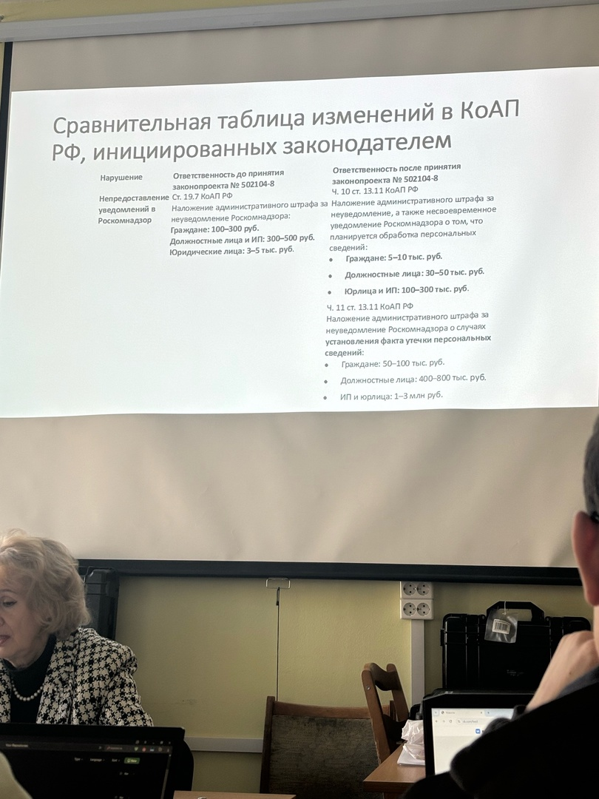
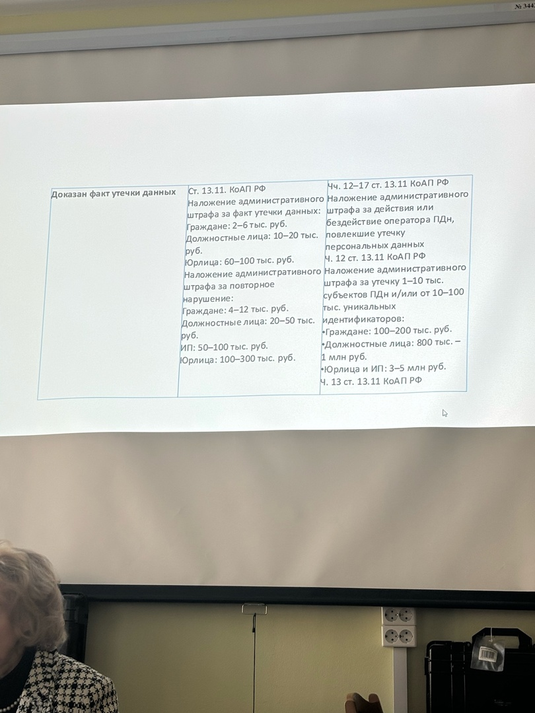

О внесении изменений в Кодекс Российской
Федерации об административных правонарушениях (в части усиления ответственности за нарушение порядка обработки персональных данных)
В Госдуме идет работа над законопроектом Nº 502104-8 «О внесении изменений в Кодекс Российской Федерации об административных правонарушениях (в части усиления ответственности за нарушение порядка обработки персональных данных)», который общественность и СМИ чаще называет «законопроектом об оборотных штрафах за утечки данных».
Законопроект предлагает усилить ответственность внесением поправок в статью 13.11
КоАП «Нарушение в области персональных данных».
Ключевые пункты этого документа:
1. Введение штрафов за неуведомление Роскомнадзора о случаях утечек персональных данных.
Эта обязанность установлена Федеральным законом от 14.07.2022 Nº 266-Ф3, который вносит соответствующие изменения в 152-Ф3 «О персональных данных». Также 266-Ф3 сократил перечень исключений в отношении персональных данных, которые оператор может обрабатывать без уведомления уполномоченного органа, то есть Роскомнадзора.
2. Усиление ответственности и введение оборотных штрафов за допущение утечек персональных данных.
В настоящее время часть 1 статьи 13.11 КоАП РФ предусматривает максимальный размер штрафа для юридических лиц до 100 тыс. руб., а при повторном совершении административного правонарушения - до 300 тыс. руб.
Уплата такого штрафа обходится компаниям дешевле, чем внедрение комплекса технических мер для противодействия утечкам и не соразмерен с возможными последствиями для владельцев украденных персональных данных.

Новое(1) в пункте Доказан факт утечки данных
Наложение административного штрафа за утечку 1-10 тыс. субъектов ПДн и/или от 10-100 тыс. уникальных идентификаторов:
• Граждане: 100-200 тыс. руб.
• Должностные лица: 800 тыс. - 1 млн руб.
• Юрлица и ИП: 3-5 млн руб.
• Ч. 13 ст. 13.11 КоАП РФ
• Наложение административного штрафа за утечку 10-100 тыс. субъектов и/или от 100 тыс. - 1 млн идентификаторов:
• Граждане: 200-300 тыс. руб.
• Должностные лица: 1-1,5 млн руб.
• Юрлица и ИП: 5-10 млн. руб.
• Ч. 14 ст. 13.11 КоАП РФ
Новое(2) в пункте Доказан факт утечки данных
Наложение административного штрафа за утечку более 100 тыс. субъектов и/или более 1 млн идентификаторов:
Граждане: 300-400 тыс. руб.
Должностные лица: 1,5-2 млн руб.
Юрлица и ИП: 10-15 млн руб.
Ч. 15 ст. 13.11 КоАП РФ
Наложение административного штрафа за повторную утечку ПДн:
Граждане: 400-600 тыс. руб.
Должностные лица: 2-4 млн руб.
Юрлица и ИП: оборотный штраф - от 0,1 до 3% от выручки за календарный год или за часть текущего года, но не менее 15 млн и не более 500 млн руб.
Ч. 16 ст. 13.11 КоАП РФ
Новое(3) в пункте Доказан факт утечки данных
Наложение административного штрафа за утечку более 100 тыс. субъектов и/или более 1 млн идентификаторов:
• Граждане: 300-400 тыс. руб.
• Должностные лица: 1,5-2 млн руб.
• Юрлица и ИП: 10-15 млн руб.
• Ч. 15 ст. 13.11 КоАП РФ
Наложение административного штрафа за утечку информации, содержащей специальные категории персональных данных:
• Граждане: 300-400 тыс. руб.
• Должностные лица: 1,5-2 млн руб.
• Юрлица и ИП: 10-15 млн руб
• Ч. 17 ст. 13.11 КоАП РФ
Наложение административного штрафа за повторную утечку ПДн:
• Граждане: 400-600 тыс. руб.
• Должностные лица: 2-4 млн руб.
• Юрлица и ИП: оборотный штраф - от 0,1 до 3% от выручки за календарный год или за часть текущего года, но не менее 15 млн и не более 500 млн руб.
• Ч. 16 ст. 13.11 КоАП РФ
Наложение административного штрафа за повторную утечку информации, содержащей специальные категории персональных данных:
• Граждане: 500-800 тыс. руб.
• Должностные лица: 3-5 млн руб.
• Юрлица и ИП: оборотный штраф - от 0,1 до 3% от выручки за календарный год или за часть текущего года, но не менее 20 млн и не более 500 млн руб.

