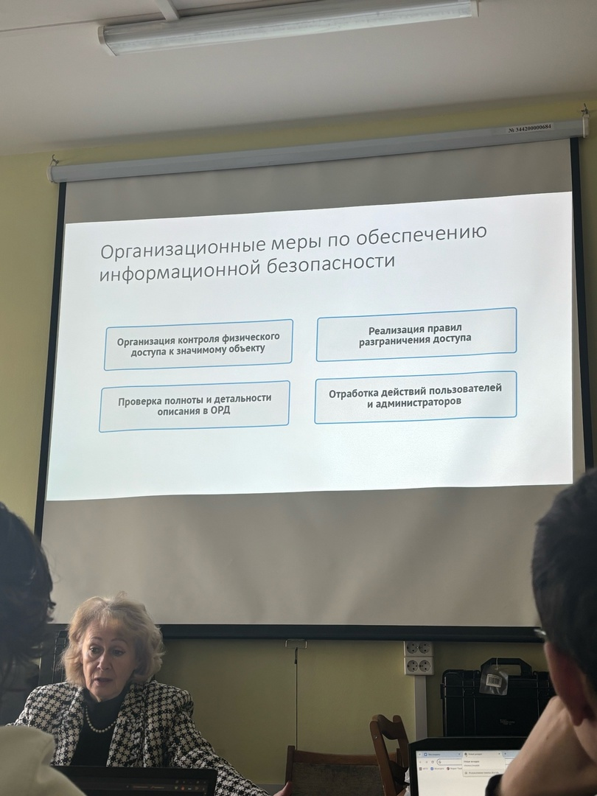

После качественно проведённого категорирования объектов КИИ субъект
КИИ приступает к построению системы обеспечения информационной безопасности КИИ (СОИБ КИИ) в соответствии с результатами категорирования и спецификой самого субъекта КИИ.
Построение СОИБ КИИ состоит из:
• Проектирование СОИБ КИИ;
• Внедрение СОИБ КИИ, состоящее из двух параллельных процессов:
• Разработка и ввод в действие внутренней документации устанавливающие подходы, правила обеспечения ИБ в информационной инфраструктуре субъекта КИИ;
• Внедрение технических мер ЗИ.

Технические меры по обеспечению информационной безопасности
• Технические меры по обеспечению безопасности в значимом объекте реализуются посредством использования программных программно-аппаратных средств, применяемых для обеспечения безопасности значимых объектов - средств защиты информации (в том числе встроенных в общесистемное, прикладное программное обеспечение)
• При использовании в значимом объекте СЗИ должны быть сертифицированы на соответствие обязательным требованиям по безопасности информации, установленным нормативными правовыми актами, или требованиям, указанным в технических условиях (заданиях по безопасности).

В случае использования в значимом объекте сертифицированных на соответствие требованиям по безопасности информации средств защиты информации:
в значимых объектах 1 категории применяются средства защиты информации не ниже 4 класса защиты, а также средства вычислительной техники не ниже 5 класса;
в значимых объектах 2 категории применяются средства защиты информации не ниже 5 класса защиты, а также средства вычислительной техники не ниже 5 класса;
в значимых объектах 3 категории применяются средства защиты информации б класса защиты, а также средства вычислительной техники не ниже 5 класса.

Для минимизации рисков и угроз безопасности КИИ рекомендуется периодический аудит СОИБ.
Аудит позволяет оценить текущую безопасность функционирования СОИБ, провести анализ рисков, связанных с возможностью осуществления угроз безопасности в отношении СОИБ и значимых объектов КИИ и сформировать новые механизмы для повышения эффективности СОИБ.
Согласно ст. 12 187-Ф3 аудит безопасности КИИ осуществляется федеральным органом исполнительной власти в целях прогнозирования возможных угроз и выработки мер по повышению устойчивости и функционирования СОИБ.
Также по данному вопросу субъект КИИ может привлекать стороннюю организацию для проведения периодического аудита СОИБ.

Штрафы для субъектов критической информационной инфраструктуры
Федеральным законом от 26.05.2021 N 141-Ф3 внесены изменения в КоАП РФ, касающиеся правонарушений в деятельности субъектов критической информационной инфраструктуры (КИИ).
С 6 июня 2021 года штраф может быть назначен за:
• Непредставление в ФСТЭК сведений о присвоении объекту КИИ категории значимости или о том, что присваивать ее не нужно. Штраф для юрлиц - от 50 000 до 100 000 руб.
• Несоблюдение порядка уведомления ФСБ о компьютерных инцидентах, реагирования на них, принятия мер по ликвидации последствий атак в отношении значимых объектов КИИ. Штраф для юрлиц - от 100 000 до 500 000 руб.
• Нарушение правил обмена информацией о компьютерных инцидентах (в частности, между субъектами КИИ). Штраф для юрлиц - от 100 000 до 500 000 руб.

С 1 сентября 2021 года штраф может быть назначен за:
• Нарушение требований к созданию и обеспечению работы систем безопасности значимых объектов КИИ. Штраф для юрлиц - от 50 000 до 100 000 руб.
• Нарушение требований к обеспечению безопасности этих объектов.
Штраф для юрлиц - от 50 000 до 100 000 руб.
• Штраф для должностных лиц по таким нарушениям составит от 10 000 до 50 000 рублей.
Срок давности привлечения к ответственности за все эти нарушения составит 1 год.