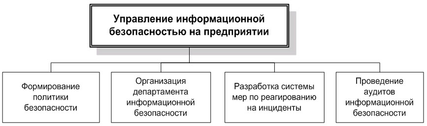
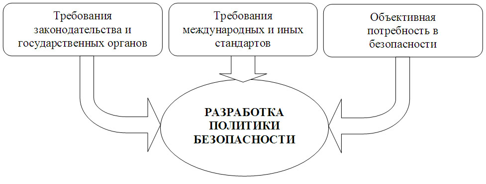
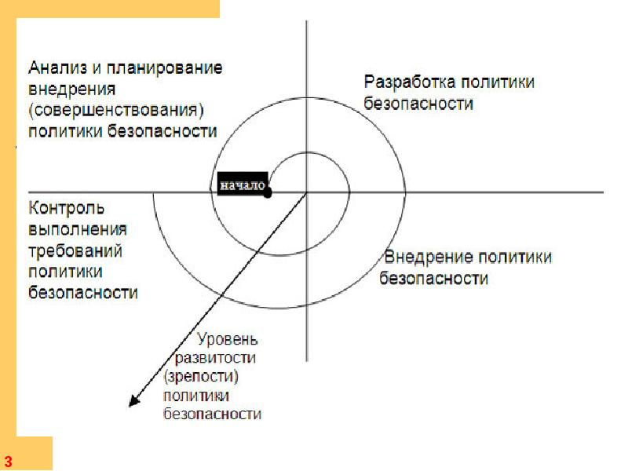

# Менеджмент в сфере информационной безопасности
## Предпосылки развития менеджмента в сфере информационной безопасности на уровне предприятий

Значимость систематической целенаправленной деятельности по обеспечению информационной безопасности становится тем более высокой, чем выше степень автоматизации бизнес-процессов предприятия и чем больше "интеллектуальная составляющая" в его конечном продукте.

Значимость обеспечения информационной безопасности в некоторых случаях может определяться наличием в общей системе информационных потоков предприятия сведений, составляющих не только коммерческую, но и государственную тайну, а также другие виды конфиденциальной информации (сведения, составляющие банковскую тайну, врачебную тайну, интеллектуальную собственность компаний-партнеров и т.п.).

Обеспечение информационной безопасности в этой сфере и, в частности, основытоя «асикти требования, организационные правила и процедуры непосредственно регламентируются федеральным законодательством, и надзор за выполнением требований осуществляется федеральными органами власти.

## Законы
Формальным основанием (предпосылкой) для осуществления целенаправленной деятельности в сфере защиты информации, помимо общегосударственных требований к защите информации, составляющей государственную, военную, врачебную и банковскую тайну, также является перечень сведений, составляющих коммерческую тайну предприятия, который определяется предприятием самостоятельно с учетом требований действующего законодательства.
-   Для сведений, составляющих государственную тайну - федеральный закон РФ от 21 июля 1993 года **Nº5485-1 "О государственной тайне"** и связанные с ним подзаконные акты.
-   Для сведений, составляющих банковскую тайну - **Федеральный закон "О банках и банковской деятельности"** и связанные с ним смежные законы и подзаконные акты.
-   Для сведений, составляющих **врачебную тайну - Основы законодательства РФ "Об охране здоровья граждан" (ст.61)** и **Закон РФ "О трансплантации органов и (или) тканей человека" (ст. 14)**;

Кроме того, необходимость разработки и внедрения политики информационной безопасности может быть обусловлена такими обстоятельствами, как:
-   необходимость уменьшения стоимости страхования информационных рисков или определенных бизнес-рисков;
-   необходимость внедрения международных стандартов, таких как **ISO 17799** или **BS 7799**.

>Общая структура управленческой работы по обеспечению информационной безопасности

Каждое из этих направлений организационной работы имеет свои особенности и должно реализовываться с использованием специфических методов менеджмента и в соответствии со своими правилами.

-   Политики и правила информационной безопасности являются **организационными документами, регулирующими деятельность всей организации или отдельных подразделений (категорий сотрудников) в части обращения с информационными системами и информационными потоками**.

-   **Департамент** информационной безопасности является узко специализированным подразделением, решающим специфические вопросы защиты информации.
-   Система мер по **реагированию на инциденты** обеспечивает готовность всей организации (включая Департамент информационной безопасности) к осмысленным целенаправленным действиям в случае каких-либо происшествий, связанных с информационной безопасностью
-   **Проведение внутренних аудитов** информационной безопасности (периодических или связанных с определенными событиями) должно обеспечить контроль за текущим состоянием системы мер по защите информации и, в частности, независимую проверку соответствия реального положения дел установленным правилам и требованиям.

### Формирование политики информационной безопасности

## Уровни политики ИБ
### Верхний уровень
**Верхний уровень** политики информационной безопасности предприятия служит:
-   для формулирования и демонстрации отношения руководства предприятия к вопросам информационной безопасности и отражения общих целей всего предприятия в этой области;
-   основой для разработки индивидуальных политик безопасности (на более низких уровнях), правил и инструкций, регулирующих отдельные вопросы;
-   средством информирования персонала предприятия об основных задачах и приоритетах предприятия в сфере информационной безопасности.

### Средний уровень

Политики информационной безопасности **среднего уровня** определяют отношение предприятия (руководства предприятия) к определенным аспектам его деятельности и функционирования информационных систем:
-   отношение и требования (более детально по сравнению с политикой верхнего уровня) предприятия к **отдельным информационным потокам и информационным системам**, обслуживающим различные сферы деятельности, степень их важности и конфиденциальности, а также требования к надежности (например, в отношении финансовой информации, а также информационных систем и персонала, которые относятся к ней);
-   отношение и требования к **определенным информационным и телекоммуникационным технологиям**, методам и подходам к обработке информации и построения информационных систем;
-   отношение и **требования к сотрудникам** предприятия как к участникам процессов обработки информации, от которых напрямую зависит эффективность многих процессов и защищенность информационных ресурсов, а такке основные направления и методы воздействия на персонал с целью повышения информационной безопасности.

### Нижний уровень
Политики безопасности на самом низком уровне относятся к **отдельным элементам информационных систем** и участкам обработки и хранения информации и описывают конкретные процедуры и документы, связанные с обеспечением информационной безопасности

## Предварительные этапы разработки
-   оценка личного (субъективного) отношения к рискам предприятия его собственников и менеджеров, ответственных за функционирование и результативность работы предприятия в целом или отдельные направления его деятельности;
-   анализ потенциально уязвимых информационных объектов;
-   выявление угроз для значимых информационных объектов (сведений, информационных систем, процессов обработки информации) и оценку соответствующих рисков.

На основе этого анализа с учетом оценок менеджеров и собственников определяются конкретные направления работы по обеспечению информационной безопасности. В том случае, когда в распоряжении компании имеются сведения, содержащие государственную, врачебную, банковскую или военную тайну, основные процедуры обращения информации определяются федеральным законодательством, а также директивами и инструкциями тех федеральных органов, в чьей компетенции находятся вопросы обращения такой информации

## Общие правила

При разработке политик безопасности всех уровней необходимо придерживаться следующих основных правил:
-   Политики безопасности на более низких уровнях должны полностью подчиняться соответствующей политике верхнего уровня, а также действующему законодательству и требованиям государственных органов;
-   Текст политики безопасности должен содержать только четкие и однозначные формулировки, не допускающие двойного толкования;
-   Текст политики безопасности должен быть доступен для понимания тех сотрудников, которым он адресован.

В целом политика информационной безопасности должна давать ясное представление **о требуемом поведении пользователей**, администраторов и других специалистов при внедрении и использовании информационных систем и средств защиты информации, а также при осуществлении информационного обмена и выполнении операций по обработке информации.

Кроме того, из политики безопасности, если она относится к определенной технологии и/или методологии защиты информации, **должны быть понятны основные принципы работы этой технологии**.

Важной функцией политики безопасности является четкое **разграничение ответственностей** в процедурах информационного обмена: все заинтересованные лица должны ясно осознавать границы как своей ответственности, так и ответственности других участников соответствующих процедур и процессов.

Также одной из задач политики безопасности является защита не только информации и информационных систем, но и **защита самих пользователей** (сотрудников предприятия и его клиентов и контрагентов).

>Общий жизненный цикл политики информационной безопасности

## Классификация информационных ресурсов

Одной из основ для реализации мероприятий в сфере информационной безопасности и детальной разработки политики безопасности является укрупненная классификация информационных ресурсов, имеющихся у предприятия.

Все имеющиеся у предприятия информационные объекты (и соответствующие элементы информационной инфраструктуры), как правило, могут быть разделены на пять или шесть основных групп по уровню своей значимости и конфиденциальности.