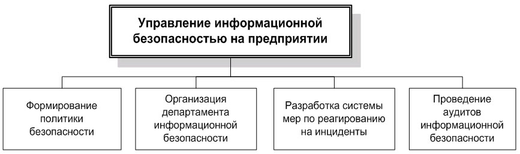
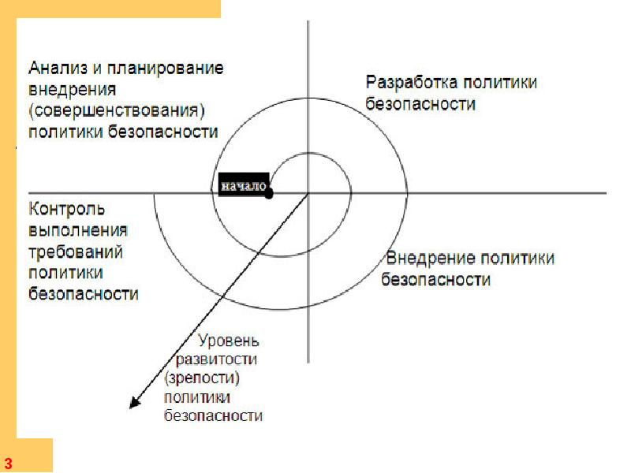

### Содержание
1. [Менеджмент в сфере информационной безопасности](#менеджмент-в-сфере-информационной-безопасности)
    -   [Предпосылки развития менеджмента в сфере информационной безопасности на уровне предприятий](#предпосылки-развития-менеджмента-в-сфере-информационной-безопасности-на-уровне-предприятий)
    -   [2. Законы](#законы)
2. [Формирование политики информационной безопасности](#формирование-политики-информационной-безопасности)
    -   [Уровни политики ИБ](#уровни-политики-иб)
        -   [Верхний уровень](#верхний-уровень)
        -   [Средний уровень](#средний-уровень)
        -   [Нижний уровень](#нижний-уровень)
    -   [Предварительные этапы разработки](#предварительные-этапы-разработки)
    -   [Общие правила](#общие-правила)
    -   [Классификация информационных ресурсов](#классификация-информационных-ресурсов)
    -   [Виды политик среднего уровня](#виды-политик-среднего-уровня)
        -   [1 тип](#1-тип)
        -   [2 тип](#2-тип)
    -   [Содержание детализированной политики безопасности.](#содержание-детализированной-политики-безопасности)
        -   [Организация внутриобъектового режима и охраны помещений и территорий](#организация-внутриобъектового-режима-и-охраны-помещений-и-территорий)
3. [Средства контроля доступа](#средства-контроля-доступа)
    -   [Биометрическая идентификация](#биометрическая-идентификация)
    -   [Физическая защита](#физическая-защита)
    -   [Сигнализация и видеонаблюдение](#сигнализация-и-видеонаблюдение)
    -   [ИБ при транспортировке](#иб-при-транспортировке)
4. [Организация режима секретности](#организация-режима-секретности)
    -   [Организация информационного обмена](#организация-информационного-обмена)
        -[передачи сведений, составляющих государственную тайну, другим государствам]()
        -[Политика опубликования материалов в открытых источниках]()
        -[Экспертный совет]()
        -[политика использования сети Интернет]()
        -[политика управления паролями]()

# Менеджмент в сфере информационной безопасности

## Предпосылки развития менеджмента в сфере информационной безопасности на уровне предприятий

Значимость систематической целенаправленной деятельности по обеспечению информационной безопасности становится тем более высокой, чем выше степень автоматизации бизнес-процессов предприятия и чем больше "интеллектуальная составляющая" в его конечном продукте.

Значимость обеспечения информационной безопасности в некоторых случаях может определяться наличием в общей системе информационных потоков предприятия сведений, составляющих не только коммерческую, но и государственную тайну, а также другие виды конфиденциальной информации (сведения, составляющие банковскую тайну, врачебную тайну, интеллектуальную собственность компаний-партнеров и т.п.).

Обеспечение информационной безопасности в этой сфере и, в частности, основытоя «асикти требования, организационные правила и процедуры непосредственно регламентируются федеральным законодательством, и надзор за выполнением требований осуществляется федеральными органами власти.

## Законы
Формальным основанием (предпосылкой) для осуществления целенаправленной деятельности в сфере защиты информации, помимо общегосударственных требований к защите информации, составляющей государственную, военную, врачебную и банковскую тайну, также является перечень сведений, составляющих коммерческую тайну предприятия, который определяется предприятием самостоятельно с учетом требований действующего законодательства.
-   Для сведений, составляющих государственную тайну - федеральный закон РФ от 21 июля 1993 года **Nº5485-1 "О государственной тайне"** и связанные с ним подзаконные акты.
-   Для сведений, составляющих банковскую тайну - **Федеральный закон "О банках и банковской деятельности"** и связанные с ним смежные законы и подзаконные акты.
-   Для сведений, составляющих **врачебную тайну - Основы законодательства РФ "Об охране здоровья граждан" (ст.61)** и **Закон РФ "О трансплантации органов и (или) тканей человека" (ст. 14)**;

Кроме того, необходимость разработки и внедрения политики информационной безопасности может быть обусловлена такими обстоятельствами, как:
-   необходимость уменьшения стоимости страхования информационных рисков или определенных бизнес-рисков;
-   необходимость внедрения международных стандартов, таких как **ISO 17799** или **BS 7799**.

>Общая структура управленческой работы по обеспечению информационной безопасности

Каждое из этих направлений организационной работы имеет свои особенности и должно реализовываться с использованием специфических методов менеджмента и в соответствии со своими правилами.

-   Политики и правила информационной безопасности являются **организационными документами, регулирующими деятельность всей организации или отдельных подразделений (категорий сотрудников) в части обращения с информационными системами и информационными потоками**.

-   **Департамент** информационной безопасности является узко специализированным подразделением, решающим специфические вопросы защиты информации.
-   Система мер по **реагированию на инциденты** обеспечивает готовность всей организации (включая Департамент информационной безопасности) к осмысленным целенаправленным действиям в случае каких-либо происшествий, связанных с информационной безопасностью
-   **Проведение внутренних аудитов** информационной безопасности (периодических или связанных с определенными событиями) должно обеспечить контроль за текущим состоянием системы мер по защите информации и, в частности, независимую проверку соответствия реального положения дел установленным правилам и требованиям.

# Формирование политики информационной безопасности

## Уровни политики ИБ
### Верхний уровень
**Верхний уровень** политики информационной безопасности предприятия служит:
-   для формулирования и демонстрации отношения руководства предприятия к вопросам информационной безопасности и отражения общих целей всего предприятия в этой области;
-   основой для разработки индивидуальных политик безопасности (на более низких уровнях), правил и инструкций, регулирующих отдельные вопросы;
-   средством информирования персонала предприятия об основных задачах и приоритетах предприятия в сфере информационной безопасности.

### Средний уровень

Политики информационной безопасности **среднего уровня** определяют отношение предприятия (руководства предприятия) к определенным аспектам его деятельности и функционирования информационных систем:
-   отношение и требования (более детально по сравнению с политикой верхнего уровня) предприятия к **отдельным информационным потокам и информационным системам**, обслуживающим различные сферы деятельности, степень их важности и конфиденциальности, а также требования к надежности (например, в отношении финансовой информации, а также информационных систем и персонала, которые относятся к ней);
-   отношение и требования к **определенным информационным и телекоммуникационным технологиям**, методам и подходам к обработке информации и построения информационных систем;
-   отношение и **требования к сотрудникам** предприятия как к участникам процессов обработки информации, от которых напрямую зависит эффективность многих процессов и защищенность информационных ресурсов, а такке основные направления и методы воздействия на персонал с целью повышения информационной безопасности.

### Нижний уровень
Политики безопасности на самом низком уровне относятся к **отдельным элементам информационных систем** и участкам обработки и хранения информации и описывают конкретные процедуры и документы, связанные с обеспечением информационной безопасности

## Предварительные этапы разработки
-   оценка личного (субъективного) отношения к рискам предприятия его собственников и менеджеров, ответственных за функционирование и результативность работы предприятия в целом или отдельные направления его деятельности;
-   анализ потенциально уязвимых информационных объектов;
-   выявление угроз для значимых информационных объектов (сведений, информационных систем, процессов обработки информации) и оценку соответствующих рисков.

На основе этого анализа с учетом оценок менеджеров и собственников определяются конкретные направления работы по обеспечению информационной безопасности. В том случае, когда в распоряжении компании имеются сведения, содержащие государственную, врачебную, банковскую или военную тайну, основные процедуры обращения информации определяются федеральным законодательством, а также директивами и инструкциями тех федеральных органов, в чьей компетенции находятся вопросы обращения такой информации

## Общие правила

При разработке политик безопасности всех уровней необходимо придерживаться следующих основных правил:
-   Политики безопасности на более низких уровнях должны полностью подчиняться соответствующей политике верхнего уровня, а также действующему законодательству и требованиям государственных органов;
-   Текст политики безопасности должен содержать только четкие и однозначные формулировки, не допускающие двойного толкования;
-   Текст политики безопасности должен быть доступен для понимания тех сотрудников, которым он адресован.

В целом политика информационной безопасности должна давать ясное представление **о требуемом поведении пользователей**, администраторов и других специалистов при внедрении и использовании информационных систем и средств защиты информации, а также при осуществлении информационного обмена и выполнении операций по обработке информации.

Кроме того, из политики безопасности, если она относится к определенной технологии и/или методологии защиты информации, **должны быть понятны основные принципы работы этой технологии**.

Важной функцией политики безопасности является четкое **разграничение ответственностей** в процедурах информационного обмена: все заинтересованные лица должны ясно осознавать границы как своей ответственности, так и ответственности других участников соответствующих процедур и процессов.

Также одной из задач политики безопасности является защита не только информации и информационных систем, но и **защита самих пользователей** (сотрудников предприятия и его клиентов и контрагентов).

>Общий жизненный цикл политики информационной безопасности

## Классификация информационных ресурсов

Одной из основ для реализации мероприятий в сфере информационной безопасности и детальной разработки политики безопасности является укрупненная классификация информационных ресурсов, имеющихся у предприятия.

Все имеющиеся у предприятия информационные объекты (и соответствующие элементы информационной инфраструктуры), как правило, могут быть разделены на пять или шесть основных групп по уровню своей значимости и конфиденциальности.

-   Критически важная (абсолютно секретная) информация - информация, требующая особых гарантий безопасности.
-   Важная информация (информация, составляющая коммерческую тайну) - информация, используемая только внутри предприятия, нарушение конфиденциальности которой может нанести серьезный ущерб самому предприятию или его партнерам.
-   Значимая (конфиденциальная) информация - информация, предназначенная для использования ограниченным кругом сотрудников и руководителей предприятия.
-   Персональная информация - информация о сотрудниках, не подлежащая разглашению.
-   Информация для внутреннего использования - информация для использования внутри предприятия, нарушение конфиденциальности которой не может нанести вреда.
-   Прочая информация - открытая информация, конфиденциальность которой не имеет особого значения для деятельности предприятия.

## Виды политик среднего уровня

Во всем объеме политик среднего уровня необходимо выделить два их основных вида.
-   Политики, относящиеся к определенным **сферам деятельности предприятия** и соответствующим информационным потокам (финансам, коммерческой деятельности и т.п.).
-   Политики, относящиеся к определенным аспектам **использования информационных технологий**, организации информационных потоков и **организации работы персонала** на всем предприятии - вне зависимости от той сферы, где используются эти технологии или занят персонал.

### 1 тип

К политикам **первого типа** могут относиться:
-   политики обращения с информацией, составляющей государственную тайну;
-   политики обращения с результатами **НИОКР**, конструкторской и технологической документацией, составляющей "ноу-хау" предприятия или его партнеров;
> НИОКР - Научно-исследовательские и опытно-конструкторские работы
-   политики безопасности такого типа уточняют и дополняют общие для всего предприятия правила, распространяющиеся на все остальные информационные системы и объекты, и, соответственно, имеют наибольший приоритет.

Они могут содержать:
-   специальные требования к резервному копированию информации (такие как более высокая частота резервного копирование и использование более надежных носителей для этого);
-   специальные требования к идентификации и аутентификации пользователей (такие как комбинирование биометрической идентификации и идентификации при помощи паролей);
-   специальные требования к копировально-множительной технике, используемой для работы с конфиденциальной информацией;
-   специальные требования к помещениям, в которых проводятся совещания по секретной тематике и обрабатывается соответствующая информация (толщина и материал стен, расположение помещений в зданиях, защищенность окон, надежность дверей и запоров, а также охранной и пожарной сигнализации, обследования на предмет выявления подслушивающих устройств и т.п.)

### 2 тип

К политикам второго типа могут относиться:
-   политика опубликования открытых информационных материалов, в том числе политика организации веб-сайта предприятия и его внутреннего информационного портала (в части предотвращения возможных утечек и искажений информации);
-   политика использования сети Интернет (в части предотвращения возможных утечек информации);
-   политики использования отдельных информационных и коммуникационных технологий, в том числе общие для всего предприятия правила использования мобильных компьютеров и КПК, удаленного доступа к корпоративными информационным системам, а также использования личных компьютеров сотрудников предприятия в служебных целях;
-   классификации информационных систем, информационных ресурсов и объектов информации с точки зрения их значимости и усилий, которые необходимо предпринимать для их защиты;

Они могут содержать:
-   политика приобретения, установки, модификации и обновления программного обеспечения, а также аутсорсинга разработки и проектирования программного обеспечения;
-   политика закупки аппаратных средств информационных систем, систем информационной безопасности;
-   политика использования пользователями собственного программного обеспечения (т.е. ПО, самостоятельно разрабатываемого предприятием);
-   общие для всего предприятия правила использования паролей и других средств персональной идентификации;
-   политика использования электронно-цифровой подписи и инфраструктуры публичных ключей;
-   политика (регламент) обеспечения внутриобъектового режима и физической защищенности информационных активов;
-   политика доступа к внутренним информационным ресурсам сторонних пользователей (организаций);
-   общий для всего предприятия порядок привлечения к ответственности за нарушение определенных правил информационной безопасности.

## Содержание детализированной политики безопасности.
### Организация внутриобъектового режима и охраны помещений и территорий
в рамках организации внутриобъектового режима может быть предусмотрено разделение помещений и территорий на отдельные зоны с ограничением доступа (в том числе на основе разделения помещений и территорий на различные категории), а также разграничение доступа отдельных сотруднико в (категорий персонала) и посетителей в различные зоны; также могут быть определены основные требования к техническим средствам разграничения доступа и организации их использования.

С технической точки зрения меры по обеспечению пропускного и внутриобъектового режимов могут быть реализованы теми же средствами, которые используются для обеспечения безопасности в других сферах, помимо информационной (защита имущества и персонала, обеспечение непрерывности производственного процесса), - средствами контроля доступа, видеонаблюдения, сигнализации и физической защиты.

# Средства контроля доступа

В основе **средств контроля доступа** лежат механизмы опознавания личности и сравнения с установленными параметрами.

Политика предприятия может устанавливать как упрощенные подходы к опознаванию, когда охранники предприятия проверяют документы (подтверждение личности, подтверждение возможности прохода на территорию в данное время через данный
КПП), использование автоматизированных средств, когда опознание посетителя и подтверждение (либо запрет) возможности прохода на территорию (выхода с территории, из здания) производится автоматизированной системой контроля доступа на основе:
-   имеющихся у посетителя машиночитаемых средств персональной идентификации (пластиковых карт, жетонов и т.п.)
-   на основе считывания и анализа его физических особенностей (геометрии лица, отпечатков пальцев, рисунка радужной оболочки глаза, голоса и т.п.).

###  Биометрическая идентификация

При выборе конкретных средств биометрической идентификации специалистам и руководителям предприятия следует помнить, что разные технологии имеют разную степень надежности, а также могут быть более или менее удобными в повседневном использовании большим количеством людей считается, что одна из передовых технологий биометрической идентификации - **идентификация по кровеносным сосудам пальца** (когда инфракрасный луч просвечивает палец и создает трехмерное изображение уникальной для каждого человека структуры кровеносных сосудов) - существенно менее уязвима для обмана, чем дактилоскопическая **идентификация**.

### Физическая защита

**Физическая защита** объектов, как правило, предполагает усиление конструкций ограждений, элементов зданий, сооружений и отдельных помещений.

К таким средствам относятся:
-   защита оконных проемов металлическими решетками и ставнями,
-   специальное остекление окон,
-   использование бронированных дверей,
-   запирающих устройств, сейфов для хранения средств вычислительной техники и носителей информации.

В соответствии с особенностями используемых помещений и территорий **политика безопасности** предприятия также может предусматривать расположение мест хранения и обработки информации (например, архивов или серверных комнат) в помещениях, наименее доступных для проникновения, наиболее удаленных от мест хранения взрывоопасных и легковоспламеняющихся веществ, наименее подверженных затоплению (для объектов расположенных в долинах рек и на побережье), наиболее защищенных от ударов молнии и т.п.

### Сигнализация и видеонаблюдение

С физической защитой непосредственно связано использование средств **сигнализации и видеонаблюдения**. В зависимости от характера охраняемого объекта (территория, здание, проход, помещение, отдельный шкаф или сейф) в средствах сигнализации могут применяться датчики, работающие на различных физических принципах (фотоэлектрические датчики, датчики объема, акустические датчики и т.п.), имеющие различные настройки и использующие различные каналы связи.

В отличие от средств сигнализации средства видеонаблюдения позволяют не только установить факт нарушения, но и в деталях отслеживать его, контролировать ситуацию, а также вести видеозапись, которую можно будет использовать для принятия дальнейших мер (поиск нарушителей, уголовное преследование и т.п.)

### ИБ при транспортировке

Отдельной задачей является обеспечение **информационной безопасности при процессе транспортировк**и носителей информации и других объектов, требующее использования как специальных организационных приемов, так и специальных технических средств. К организационным методам относится привлечение специально подготовленных курьеров, а также разделение носителей информации (объектов) на части и их раздельная транспортировка с целью минимизации возможностей утечки информации.

К техническим средствам, применяемым при транспортировке объектов, относятся защищенные контейнеры, специальные упаковочные материалы, а также тонкопленочные материалы и голографические метки, позволяющие идентифицировать подлинность объектов и контролировать несанкционированный доступ к ним.

# Организация режима секретности

Организация режима секретности в учреждениях и на предприятиях в РФ основывается на требованиях федерального законодательства, касающегося вопросов государственной тайны, и соответствующих подзаконных актов.

В соответствии с действующими нормами к государственной тайне может быть отнесена информация, касающаяся обороноспособности страны, ее экономики, международных отношений, государственной безопасности и охраны правопорядка (в том числе сведения о методах и средствах защиты секретной информации, а также о государственных программах и мероприятиях в области защиты государственной тайны);

в законодательстве также специально уточняются области деятельности, информация о которых не может быть отнесена к государственной тайне. Отнесение конкретной информации к государственной тайне производится решением специально назначаемых должностных лиц, а общий Перечень сведений, отнесенных к государственной тайне, утверждается Президентом РФ и подлежит обязательному опубликованию.

Для сведений, составляющих государственную тайну, устанавливаются три степени секретности:
"особой важности", "совершенно секретно" и "секретно", а носители таких сведений (документы) должны иметь соответствующие реквизиты.

## Допуск к сведениям, составляющим государственную тайну

Основным элементом организации режима секретности является допуск должностных лиц и граждан к сведениям, составляющим государственную тайну. Он предполагает выполнение руководством предприятия и подразделений по защите государственной тайны (во взаимодействии с уполномоченными правохранительными )органами следующих основных мероприятий.

-   ознакомление должностных лиц и граждан с нормами законодательства, предусматривающими ответственность за нарушение требований.

-   получение согласия на временные ограничения их прав в соответствии с законодательством.

-   получение согласия на проведение в отношении их проверочных мероприятий.

-   принятие решения о допуске к сведениям, составляющим государственную тайну.

-   заключение с лицами, получившими допуск, трудового договора (контракта), отражающего взаимные обязательства таких лиц и администрации предприятия (в т.ч. обязательства таких лиц перед государством по нераспространению доверенных им сведений, составляющих государственную тайну).

## Организация информационного обмена

Помимо отнесения сведений к государственной тайне и допуска должностных лиц и граждан к засекреченным сведениям, важным элементом системы обеспечения режима секретности является организация информационного обмена между предприятиями при совместном выполнении работ.

В частности, передача засекреченных сведений от одного предприятия к другому должна производиться **с разрешения уполномоченного государственного органа**, договор на выполнение работ должен предусматривать обязательства сторон по обеспечению сохранности сведений, а заказчик работ должен контролировать выполнение нормативных требований контрагентами по таким договорам (наличие лицензий, оформление допуска сотрудников и т.п.) и принимать необходимые меры в случае выявления нарушений.

### передачи сведений, составляющих государственную тайну, другим государствам

Также важным элементом обеспечения режима секретности является организация **передачи сведений, составляющих государственную тайну, другим государствам** (в том числе ознакомление с такими сведениями и предоставление возможности доступа к ним).

В каждом отдельном случае решение о передаче сведений выносится Правительством
РФ на основании экспертного заключения Межведомственной комиссии по защите государственной тайны, которая, в свою очередь, руководствуется мотивированным ходатайством предприятия, заинтересованного в передаче секретных сведений, и решением органа государственной власти, курирующего круг вопросов, к которому относятся передаваемые сведения.

Для обеспечения защиты интересов РФ со стороной, принимающей секретные сведения, заключается договор, содержащий необходимые обязательства по защите получаемой информации, а также порядок разрешения конфликтных ситуаций и компенсации возможного ущерба.

### Политика опубликования материалов в открытых источниках
**Политика опубликования материалов в открытых источниках** (таких как газеты, журналы, выставки, сеть Интернет, радио- и телепередачи, конференции, музейные экспозиции и т.п.) должна обеспечивать предотвращение случайных и организованных утечек конфиденциальной информации при взаимодействии предприятия со средствами массовой информации, общественными и государственными органами, научным, академическим и бизнес-сообществом.

Для того чтобы избежать ущерба интересам предприятия, такая политика должна содержать основные правила и процедуры подготовки информационных материалов к открытому опубликованию. В частности, в политике безопасности следует предусматривать создание специального экспертного совета, ответственного за рассмотрение всех информационных материалов, которые предполагается опубликовать в открытых источниках

### Экспертный совет

Основной задачей такого совета является подготовка заключений о возможности или невозможности опубликования определенных информационных материалов, а также подготовка конкретных предложений по изъятию определенных сведений из материалов, подготавливаемых к опубликованию.

При отсутствии единого мнения у членов экспертной комиссии решение о возможности опубликования может быть принято руководителем предприятия с учетом рекомендаций экспертов.

Для эффективного решения задач члены экспертного совета должны детально знать все существующие ограничения (в частности, установленные законодательством) и владеть ситуацией в той сфере, в которой функционирует предприятие. При этом, как правило, сам автор подготавливаемых к опубликованию материалов не может входить в экспертный совет, а редактор или руководитель, отвечающий за подготовку материалов, не может быть председателем экспертного совета

### политика использования сети Интернет

**Основой политики использования сети Интернет** являются некоторые положения
Указа Президента РФ от 12 мая 2004 года Nº 611 "О мерах по обеспечению информационной безопасности Российской Федерации в сфере международного информационного обмена", регламентирующего вопросы подключения локальных сетей и персональных компьютеров к сети Интернет, а также размещение информации в сети интернет для некоторых категорий пользователей. Данный документ:
-   запрещает включение информационных систем, сетей связи и автономных персональных компьютеров, где обрабатывается информация, содержащая сведения, которые составляют государственную тайну, и служебная информация ограниченного распространения, а также для которых установлены особые правила доступа к информационным ресурсам, в состав средств международного информационного обмена, в том числе в сеть "Интернет";
-   предписывает владельцам открытых и общедоступных государственных информационных ресурсов осуществлять их включение в состав объектов международного информационного обмена только при использовании сертифицированных средств защиты информации, обеспечивающих ее целостность и доступность, в том числе криптографических для подтверждения достоверности информации

### политика управления паролями

**Политика управления паролями** (или, в более общем виде, политика идентификации и аутентификации) может определять
-   периодичность замены паролей,
-   действия, которые необходимо осуществить при компрометации паролей,
-   основные требования к их качеству, процедурам их генерации,
-   распределению основных обязанностей, связанных с генерацией паролей, их сменой и доведением до пользователей,
-   основные меры ответственности за нарушение установленных правил и требований.

Политика на этом уровне также может устанавливать запрет хранения записанных паролей, запрет сообщать кому-либо свой пароль (в том числе руководителям и администраторам информационных систем) и другие аналогичные ограничения.

### Политика установки и обновления версий программного обеспечения

Может включать в себя некоторые ограничения на самостоятельное приобретение и установку программного обеспечения отдельными подразделениями и пользователями, а также определенные требования к квалификации специалистов, осуществляющих их установку, настройку и поддержку.

Политика приобретения информационных систем и их элементов (программных и аппаратных средств) может включать в себя требования к лицензированию и сертификации используемых программного обеспечения и оборудования, а также определенные требования к фирмам, осуществляющим их поставку и внедрение.

### Политика в отношении разработки ПО

Политика в отношении разработки ПО может содержать:
-   требования как к вопросам безопасности и надежности программных средств
-   самостоятельно разрабатываемых предприятием,
-   передачи разработки программных средств (модулей информационных систем, отдельных программных библиотек и т.п.) сторонним специализированным организациям (т.н. "аутсорсинг"),
-   в отношении приобретения и использования тиражируемых программных библиотек (модулей), распространяемых компаниями-производителями.
-   В частности, политика может содержать требования к тестированию самостоятельно разрабатываемого ПО, анализу его исходных кодов, описывать основные критерии надежности и т.п.

### Политики использования универсальных информационных технологий
Политики использования отдельных универсальных информационных технологий в масштабе всего предприятия могут включать в себя:
-   политику использования электронной почты (e-mail);
-   политику использования средств шифрования данных;
-   политику защиты от компьютерных вирусов и других вредоносных программ;
-   политику использования модемов и других аналогичных коммуникационных средств;
-   политику использования Инфраструктуры публичных ключей;
-   политику использования технологии Виртуальных частных сетей (Virtual Private Network - VPN)

### Политика использования электронной почты

Политика использования электронной почты может включать в себя:
-   общие ограничения на ее использование определенными категориями сотрудников,
-   требования к управлению доступом и сохранению конфиденциальности сообщений,
-   требования к администрированию почтовой системы и хранению электронных сообщений.

Кроме того, политика может предусматривать:
-   запрет на использование электронной почты в личных целях;
-   специальные требования к отправке и получению присоединенных файлов, которые потенциально могут содержать вредоносные программы;
-   запрет на использование электронной почты временными сотрудниками;
-   требования шифрования передаваемых сообщений;
-   наблюдение за всеми передаваемыми и получаемыми сообщениями;
-   ограничения на передачу конфиденциальной информации при помощи электронной почты и другие положения.