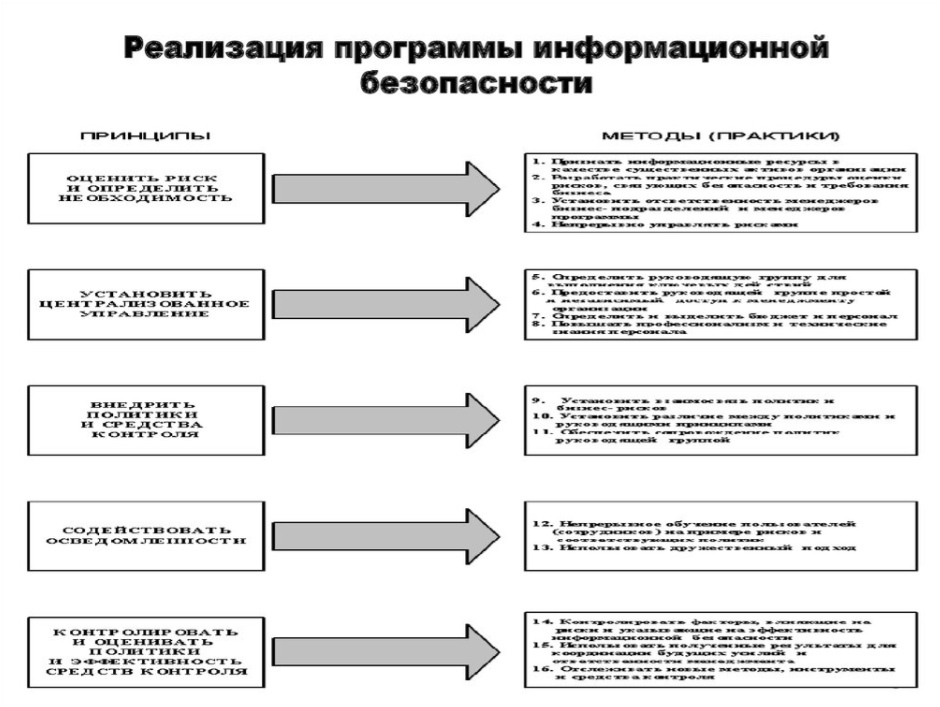

<html>
<body>

<h1>Порядок информирования ФСБ России о компьютерных инцидентах, реагирования на них, принятия мер по ликвидации последствий компьютерных атак, проведенных в отношении значимых объектов критической информационной инфраструктуры Российской Федерации
</h1>
<h3> 
    <strong>
    Приказ ФСБ России от 19 июня 2019 г. N 282
    </strong>
</h3>

 Субъекты критической информационной инфраструктуры <strong> информируют ФСБ России обо всех компьютерных инцидентах </strong>, связанных с функционированием принадлежащих им на праве собственности, аренды или ином законном основании <strong>объектов критической информационной инфраструктуры.</strong>

Информирование осуществляется <strong> путем направления информации</strong>в Национальный координационный центр по компьютерным инцидентам (<strong>НКЦКИ</strong>) в соответствии с определенными НКЦКИ форматами представления информации о компьютерных инцидентах в государственную систему обнаружения, предупреждения и ликвидации последствий компотерных атак (<strong>ГосСОПКА</strong>
) на информационные ресурсы Российской Федерации с использованием технической инфраструктуры НКЦКИ, предназначенной для отправки, получения, обработки и хранения уведомлений и запросов в рамках информационного взаимодействия с субъектами критической информационной инфраструктуры, а также с иными, не являющимися субъектами критической информационной инфраструктуры, органами и организациями, в том числе иностранными и международными.

<strong>Информация</strong>о компьютерном инциденте,<strong>связанном с функционированием</strong>значимого объекта критической информационной инфраструктуры, направляется субъектом критической информационной инфраструктуры<strong>в НКЦКИ в срок не позднее 3 часов с момента обнаружения</strong>компьютерного инцидента, а в отношении<strong>иных объектов критической информационной инфраструктуры - в срок не позднее 24 часов</strong>с момента его обнаружения.

В случае если комльютерный инцидент связан с функционированием объекта критической информационной инфраструктуры, принадлежащего на праве собственности, аренды или ином законном основании субъекту критической информационной инфраструктуры, который осуществляет деятельность<strong>в банковской сфере</strong>и в иных сферах финансового рынка, информация о компьютерном инциденте также направляется в Банк России с использованием технической инфраструктуры Банка России в сроки, установленные пунктом 4 настоящего Порядка.

 <strong>Для подготовки к реагированию</strong> на компьютерные инциденты и принятию мер по ликвидации последствий компьютерных атак субъектом критической информационной инфраструктуры, которому на праве собственности, аренды или ином законном основании принадлежит значимый объект критической информационной инфраструктуры, <strong>в срок до 90 календарных дней со дня включения данного объекта в реестр</strong> значимых объектов критической информационной инфраструктуры Российской Федерации <strong>разрабатывается план реагирования</strong> на компьютерные инциденты и принятия мер по ликвидации последствий компьютерных атак, содержащий:
<ul>
<li>Утехнические характеристики и состав значимых объектов критической информационной инфраструктуры;</li>
<li>события (условия), при наступлении которых начинается реализация предусмотренных Планом мероприятий;</li>
<li><strong>мероприятия</strong>, проводимые в ходе реагирования на компьютерные инциденты и <strong>принятия мер</strong> по ликвидации последствий компьютерных атак,<strong>а также время</strong>, отводимое на их реализацию;</li>
<li>описание состава подразделений и должностных лиц субъекта критической информационной инфраструктуры, ответственных за проведение мероприятий по реагированию на компьютерные инциденты и принятие мер по ликвидации последствий компьютерных атак.</li>
</ul>

При необходимости в План включаются:
<ul>
<li>условия привлечения подразделений и должностных лиц ФСБ России к проведению мероприятий по реагированию на компьютерные инциденты и принятию мер по ликвидации последствий компьютерных атак;</li>
</ul>

<strong> Проект Плана </strong>, содержащий положения, разрабатывается субъектом критической информационной инфраструктуры совместно с НКЦКИ и направляется на <strong>согласование в ФСБ России</strong>. ФСБ России рассматривает проект Плана <strong>в срок до 30 календарных</strong> дней и по результатам рассмотрения согласовывает его или возвращает без согласования для доработки

<strong>Субъект</strong> критической информационной инфраструктуры, которому на праве собственности, аренды или ином законном основании принадлежат значимые объекты критической информационной инфраструктуры, <strong>не реже одного раза в год организует и проводит тренировки по отработке мероприятий Плана</strong>.

Объем и содержание тренировки определяются субъектом критической информационной инфраструктуры с учетом мероприятий, содержащихся в Плане.

Субъект критической информационной инфраструктуры, которому на праве собственности, аренды или ином законном основании принадлежат значимые объекты критической информационной инфраструктуры, в ходе реагирования на компьютерные инциденты и принятия мер по ликвидации последствий компьютерных атак осуществляет:
<ul>
<li>анализ компьютерных инцидентов (включая определение очередности реагирования на них), установление их связи с компьютерными атаками;</li>
<li>проведение мероприятий в соответствии с Планом;</li>
<li>определение в соответствии с Планом необходимости привлечения к реагированию на компьютерные инциденты и принятию мер по ликвидации последствий компьютерных атак подразделений и должностных лиц ФСБ России и Банка России.</li>
</ul>

 

<strong>Перед принятием мер по ликвидации</strong> последствий компьютерных атак <strong>субъект</strong> критической информационной инфраструктуры, которому на праве собственности, аренды или ином законном основании принадлежат значимые объекты критической информационной инфраструктуры, <strong>определяет</strong>:
<ul>
<li><strong>состав подразделений и должностных лиц</strong> субъекта критической информационной инфраструктуры, ответственных за проведение мероприятий по реагированию на компьютерные инциденты и принятие мер по ликвидации последствий компьютерных атак, <strong>и их задачи в рамках принимаемых мер</strong>; </li>
<li><strong>перечень средств</strong>, необходимых для принятия мер по ликвидации последствий компьютерных атак;</li>
<li><strong>очередность значимых объектов</strong> критической информационной инфраструктуры (их структурных
элементов),<strong>в отношении которых будут приниматься меры</strong> по ликвидации последствий
компьютерных атак;</li>
<li><strong>перечень мер по восстановлению</strong> функционирования значимого объекта критической
информационной инфраструктуры.</li>
</ul>

<strong>О результатах мероприятий</strong> по реагированию на компьютерные инциденты и принятию мер по ликвидации последствий компьютерных атак субъект критической информационной инфраструктуры, которому на праве собственности, аренды или ином законном основании принадлежат значимые объекты критической информационной инфраструктуры,<strong>информирует НКЦКИ в срок не позднее 48 часов после завершения таких мероприятий</strong>

<h3>Инциденты информационной безопасности могут быть отнесены к одной из следующих групп</h3>

<ul>
    <li>вирусная активность;</li>
    <li>ненадлежащее использование ИТ-ресурсов Компании;</li>
    <li>попытки получения несанкционированного доступа;</li>
    <li>DoS-атаки, системные сбои, отказы в доступе;</li>
    <li>утечка конфиденциальной информации или персональных данных;</li>
    <li>инциденты в платежных системах, финансовые махинации и хищения денежных средств.</li>
</ul>

<h3>Ресурсы для расследования</h3>

В процессе расследования инцидента команда реагирования должна иметь доступ ко всем необходимым ресурсам корпоративной сети и информационным системам организации:
<ul>
    <li>просмотру состояния сетевых портов;</li>
    <li>видетельствам и журналам функционирования операционных систем, приложений, сетевых сервисов, межсетевых экранов, систем обнаружения вторжений, сигнатур антивирусов и прочих СЗИ от НСД;</li>
    <li>просмотру журналов событий наиболее критичных ресурсов корпоративной сети (веб-серверы, серверы электронной почты, FTP-серверы и т.п.);</li>
    <li>просмотру журналов активности приложений;</li>
    <li>журналам регистрации событий криптографических средств</li>
     <li>операционным системам, для анализа журнальных файлов, в том числе, с правами администратора;</li>
    <li>данным об загружаемых обновлениях в операционных средах;</li>
    <li>информации о регламентах резервного копирования и тестировании резервных носителей.</li>
</ul>

<h3>Проведение криминалистического исследования</h3>

Процедура проведения криминалистического исследования включает:
<ul>
    <li>оперативное реагирование и консультацию в случае уведомления об инциденте (выезд специалиста в офис клиента, снятие образов с жестких дисков);</li>
    <li>выявление на предоставленных жестких дисках вредоносного ПО, предоставляющего несанкционированный доступ к информации или возможность уничтожения, модификации, копирования и кражи данных, а также следов других мошеннических действий;</li>
     <li>выявление фактов удаленного администрирования и компрометации логина/пароля;</li>
     <li>анализ и описание функциональности обнаруженного вредоносного ПО, выявление причин возникновения инцидента (действия вредоносного ПО, мошеннические или безответственные действия пользователя и др.), восстановление хронологии событий инцидента;</li>
     <li>нотариальное заверение протокола осмотра выявленных веб-ресурсов, с которых произошла загрузка вредоносного ПО (при необходимости);</li>
     <li>проведение аналитических работ по идентификации причастных к инциденту лиц, а также описание предполагаемых методов совершения инцидента.</li> 
</ul>

Политика менеджмента инцидентов ИБ должна включать в себя следующие вопросы:
<ul>
<li>значимость менеджмента инцидентов ИБ для организации, а также обязательства высшего руководства атносительно поддержки менеджмента и его системы,</li>
<li>общев представление об обнаруженни событий ИБ, оповещении о них и сборе соответствующей информация, а таже о путих использования этой информации для определения инцидентов ИБ. Это общее представление далино содержать перечень возможных событий ИБ, а также информацию о том, как сообщать о ней, что, где и ному сообщить, а также как обращаться с совершенно новыми событиями</li>
<li>общев предстевление об оценке инцидентов ИБ, включая перечень ответственных лиц, необходимые Для выполнения действия, уведомления об инцидентах и дальнейшие действия ответственных лиц,</li>
<li>краткое изложение действий после подтверждения того, что событие ИБ является инцидентом ИБ. Эти действия представляют + немедленное реагирование;</li>
<li>правовую зиспертизу;</li>
<li>передачу информации соответствующему персоналу или сторонним организациям;</li>
<li>проверку, находится ли инцидент ИБ под контролем;</li>
<li>дальнейшее реагирование;</li>
<li>объеление "кризисной ситуации";</li>
<li>определение критериев усиления реагирования на инциденты ИБ;</li>
<li>определение ответственного за инцидент лица;</li>
<li>ссылку на необходимость правильной регистрации всех действий для дальнейшего и непрерывного мониторинга с целью обеспечения защищенного хранения свидетельств в электронном виде на случай их востребования для судебного разбирательства или дисциплинарного расследования внутри организации;</li>
<li>подробности места хранения документации о системе, включая процедуры хранения;</li>
</ul>

Вопросы, связанные с деятельностью ГРИИБ:
<ul>
<li>организационную структуру ГРИИБ и весь основной персонал группы, включая лиц, ответственных за:
    <ul>
        <li>краткое информирование высшего руководства об инцидентах;</li>
        <li>проведение расследований и другие действия персонала группы после объявления "кризисной ситуации*;</li>
        <li>связь со сторонними организациями (при необходимости);</li>
    </ul>
</li>
</ul>

Положение о менеджменте ИБ, область деятельности ГРИИБ и полномочия, в рамках которых она будет осуществлять. Это положение должно включать в себя, как минимум, формулировку целевого назначения определение области деятельности ГРИИБ и подробности об учредителе ГРИИБ и его полномочиях формулировку целей ГРИИБ применительно к основной деятельности группы персонала. Для выполнения своих функций персонал должен участвовать в оценке инцидентов ИБ реагировании на них и управлении ими, а также в их успешном разрешении. Для целей и назначения ГРИИБ требуется четкое и однозначное определение. Определение сферы деятельности ГРИИБ. Обычно в сферу деятельности ГРИИБ организации входят все информационные системы, сервисы и сети организации. В некоторых случаях для организации может потребоваться сужение сферы действия ГРИИБ. При этом необходимо четко документировать, что входит и что не входит в сферу ее деятельности;
перед личность санкционирует обнародованием учредителя действия ГРИИБ- ГРИИБ подробностей и старшего, о устанавливает создании должностного уровни и лица структуре полномочий, (член ГРИИБ правления, переданных необходимо старший ГРИИБ проверить Следует руководитель), законность отметить, который этого действия. В некоторых обстоятельствах раскрытие полномочий группы персонала может послужить причиной
предъявления ей претензий по нарушению обязательств;

<h3>
Содержание программы менеджмента инцидентов информационной безопасности
</h3>

В содержание программы менеджмента инцидентов ИБ должны быть включены детальные процессы и процедуры, информация о соответствующих сервисных программах и шкалах, связанных для этапа "Планирование и подготовка":
<ul>
<li> с обнаружением и оповещением о появлении событий ИБ (человеком или автоматическими средствами),</li>
<li>со сбором информации о событиях ИБ, с проведением оценок событий ИБ (включая, если потребуется, их детализацию),</li>
<li>используя принятую шкалу серьезности событий/инцидентов, и определением их способности к изменению своей категории на категорию инцидентов ИБ,</li>
</ul>

<h3>
Вредные воздействия на окружающую среду
</h3>

<strong></strong>
При этом должны рассматриваться следующие сценарии развития компьютерных
инцидентов:
<ul>
<li>инциденты, из-за которых возможно возникновение техногенных катастроф на
производстве (взрывы, утечки и разливы опасных веществ);</li>
<li>инциденты, связанные с нарушением работы объекта (нарушение параметров техпроцесса
нарушение работы или состояния исполнительных механизмов и т.д.).</li>
</ul>
Делать прогноз возможного развития аварии или сбоя нужно без учета аварийных систем (за
исключением вариантов, когда данные системы являются неотъемлемой технологической
частью системы, на которую атака в целом не рассматривается)
Масштаб возможного ущерба оценивается относительно:
<ul>
<li>территории, на которой окружающая среда может подвергнуться вредным воздействиям;</li>
<li>количества людей, которые могут быть подвержены вредным воздействиям (тыс. человек).</li>
</ul>

<h3>Прекращение или нарушение функционирования (невыполнение установленных показателей) пункта управления (ситуационного центра)</h3> 

Данный критерий касается объектов (систем, сетей связи), непосредственно обеспечивающих функционирование данных пунктов реагирования и центров 

Должны рассматриваться инциденты, из-за которых возможно прекращение или нарушение работы объектов, влекущие нарушение функционирования пунктов управления и ситуационных центров

Данный критерий не привязан к длительности нарушений и оценивается исходя из характеристик (значимости) пункта управления или ситуационного цента, работа которого нарушается:
<ul>
<li>пункта управления или ситуационного центра органа государственной власти субъекта субъекта РФ или города федерального значения;</li>
<li>пункта управления или ситуационного центра федерального органа государственной власти или государственной корпорации;</li>
<li>пункта управления государством или ситуационного центра Администрации Президента РФ, Правительства РФ, Федерального Собрания РФ, Совета Безопасности РФ, Верховного Суда РФ, Конституционного Суда Рф.</li>
</ul>

<h3>Снижение показателей государственного оборонного заказа, выполняемого (обеспечиваемого) субъектом критической информационной инфраструктуры</h3>

Данный критерий касается субъектов КИИ, являющихся головными исполнителями или исполнителями по государственному оборонному заказу и их объектов КИИ, задействованных в разработке, производстве, поставке продукции по государственному оборонному заказу

Для организаций, выпускающих продукцию двойного назначения и поставляющих ее исполнителю государственного оборонного заказа, данный показатель предлагается считать недействительным, так как на них не распространяются обязательства и ответственность за выполнение государственного оборонного заказа и они не имеют возможности оценки итогового объема конечной продукции по нему.

<h3>Должны рассматриваться инциденты, из-за которых возможно прекращение или нарушение работы объектов КИИ, влекущие нарушение процессов реализации государственного оборонного заказа.</h3>

<ul>
<li>Нарушение производства;</li>
<li>Изменение скорости выпуска продукции</li>
</ul>
Масштаб ущерба, оцениваемый в снижении объемов продукции (работ, услуг) в заданный период времени (процентов заданного объема продукции) должен оцениваться для прогнозируемого нарушения, которое может повлечь снижение объема соответствующей продукции.

<h3>
Прекращение или нарушение функционирования (невыполнениe установленных показателей) информационной системы в области обеспечения обороны страны, безопасности государства и правопорядка, оцениваемые в максимально допустимом времени, в течение которого информационная
система может быть недоступна пользователю (часов)</h3>

Масштаб возможного ущерба оценивается на основании целевого показателя допустимого времени недоступности рассматриваемой системы обеспечения обороны страны безопасности государства и правопорядка.

Оценка ущерба осуществляется для разового нарушения с наибольшим прогнозируемым воздействием на объект (нарушение доступности соответствующей системы) 

При оценке возможных последствий необходимо рассматривать максимальный негативный сценарий, без учета компенсирующих защитных мер.

</h3>
</body>
</html>